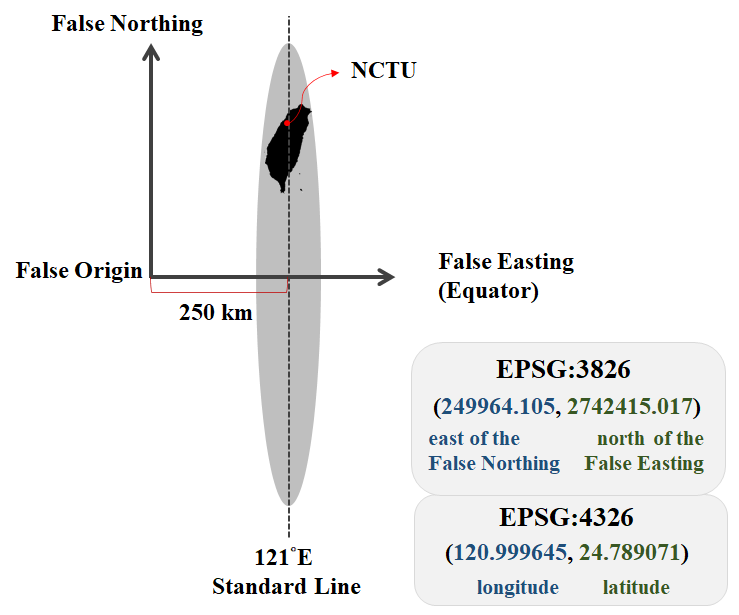

```{r setup1, include=FALSE}
knitr::opts_chunk$set(echo = TRUE)
library(dplyr)
library(sf)
library(ggplot2)
library(ggsflabel)
library(ggspatial)
library(knitr)
library(kableExtra)
library(spData)
library(tmap)
library(leaflet)
library(classInt)
library(cowplot)
```

# **Basic Knowledge on GIS**

## Geographic Information Systems
Geographic Information Systems (GIS) store, analyze, and visualize data for geographic positions on Earth’s surface. The four major features of GIS are listed below.  

* Create geographic data.
* Manage spatial data in a database.
* Analyze and find patterns.
* Map Visualization.

In this notebook, we would focus on the issue about spaitial analysis and making visualized maps.  

The detailed concept of GIS can be derived on the textbook [*_“Introduction to Geographic Information Systems (Kang Tsung Chang)”_*](https://www.academia.edu/28691712/Introduction_to_GIS_Kang_Tsung_Chang_pdf?email_work_card=title).


## Well-Known Text (WKT)
Well-known text (WKT) is a text markup language for representing vector geometry objects. The common type of geometric objects are marked as shown in the table below.  

```{r wkt_type, echo=F, eval=T}
wkt_type=data.frame(Type=c("**Point**","**LineString**","**Polygon**"), Graph="", WKT=c("POINT (3 3)","	LINESTRING (1 4, 3 3, 5 5)","POLYGON ((1 4, 2 2, 4 1, 5 5, 1 4))"))
kbl(wkt_type, booktabs=T)%>%
  kable_styling(bootstrap_options=c("striped", "hover"), font_size=14)%>%
  column_spec(2, image=spec_image(c("./graph/point.png", "./graph/line.png","./graph/polygon.png"), 500, 500))
```

The WKT types illustrated above are single geometry. However, sometimes we want to mark all the geometry together to signify the same attribute, single geometry may seem to be difficult to express. For instance, there are five campuses in NCTU. If we want to combine all the points into one single geometry, in order to represent “NCTU”, it is hard to express by POINT text. Thus, we need multi geometries to mark it.  

Multi geometries are available to represent more than one geometry of the same dimension in a single object, including MultiPoint, MultiLineString, MultiPolygon. Geometry Collection is the geometries of different dimensions.  


## Shapefile
The shapefile format is a universal geospatial vector data format. It is developed and regulated by [Esri](https://www.wikiwand.com/en/Esri), which is an international supplier of GIS software. The shapefile format can illustrate the vector features: points, lines, and polygons. In fact, shapefile is not a single file, but a collection containing four mandatory files. Each file is briefly introduced as the following.  

```{r shape_file, echo=F, eval=T}
shape_file=data.frame(File=c(".shp",".dbf",".prj",".shx"), Features=c("shape format; the feature geometry","	attribute format; attributes for each shape, stored as two-dimensional table","projection description, using a well-known text representation of coordinate reference systems","shape index format; a positional index of the feature geometry to allow seeking forwards and backwards quickly"))
kbl(shape_file, booktabs=T)%>%
  kable_styling(bootstrap_options=c("striped", "hover"), font_size=14)%>%
  column_spec(1, bold=T)
```

## Coordinate Reference System (CRS)
Geometric data is not geospatial unless it is accompanied by coordinate reference system (CRS) information, which allows GIS to display and operate the data accurately. It includes two major components, datum and projection. Datum is a model of the shape of the earth. It has angular units (degrees) and defines the starting point (0,0), and hence the coordinate can represent a specific spot on the earth. Projection is a mathematical transformation of the angular measurements on a round earth to a flat surface. The units associated with a given projection are usually linear (feet, meters, etc.).  

There are two common types of coordinate systems:  


```{r crs_type, echo=F, eval=T}
crs_type=data.frame(Type=c("**Geographic Coordinate Systems**","**Projected Coordinate System**"), Features=c("A global or spherical coordinate system such as latitude–longitude.","Based on a map projection such as [transverse Mercator](https://www.wikiwand.com/en/Transverse_Mercator_projection), [Albers equal area](https://www.wikiwand.com/en/Albers_projection), or [Robinson](https://www.wikiwand.com/en/Robinson_projection), which project the spherical surface onto a two-dimensional coordinate plane."), Example=c("EPSG:4326\\\n(World Geodetic System 1984)","EPSG:3826\\\n(TWD97 / TM2 zone 121, Taiwan Datum 1997)"))
kbl(crs_type, booktabs=T)%>%
  kable_styling(bootstrap_options=c("striped", "hover"), font_size=14)%>%
  column_spec(1, width="5em")%>%
  column_spec(2, width="29em")
```

To understand the difference of CRS type clearly, let’s take NCTU for example. The coordinate of it can be recorded as (120.999645, 24.789071) in EPSG:4326. x coordinate represents longitude, while y coordinate is latitude. Also, it can be recorded as (249964.105, 2742415.017) in EPSG:3826. In this projected coordinate system, we define 121°E as standard line, and 250 kilometers west of it is defined as false northing, while the equator is defined as false easting. x coordinate represents that the spot is located at 249964.105 meters east of the false northing. y coordinate illustrates that the spot is located at 2742415.017 meters north of the equator.  
<font size="1"><b>Something interesting... The center of NCTU (Guangfu Campus) is very close to standard line (249964.105 m ~ 250 km). In fact 121°E traverses the campus!</b></font>

```{r CRS_taiwan, echo=F, out.width="60%", fig.align="center"}

```

## Why Use R?
R is a programming language mainly for statistical computing and graphics. With a wide range of packages, R supports advanced geospatial statistics, modeling and visualization. In addition, integrated development environments such as RStudio have made it more user-friendly, allowing us to easily analyze spatial data and make maps.  

Using R to do analysis, we need first to download the [software](https://cran.csie.ntu.edu.tw/) and its development environments ([RStudio](https://rstudio.com/products/rstudio/download/)).


## Required Packages
To conduct the geocomputation in R, it is required to download `sf` package.  

To analyze the data more efficiently, it is suggested to take advantage of `dplyr` package.  

To display the map, `ggplot2` package is strongly recommended. (There are other packages to make the map as well; nonetheless, `ggplot2` is more powerful and easier to learn.)  

```{r required_packages, echo=T, eval=F}
install.packages("sf")
install.packages("dplyr")
install.packages("ggplot2")
library(sf)
library(dplyr)
library(ggplot2)
```

<font size=4> **_Data_** </font><br> 
Data required in this book are provided [**here**](https://drive.google.com/uc?export=download&id=1TSavur6YcaJO5DCCb5Hsb0HICdwZpeXi), please download the data and place it in the same directory of the R script.  

Besides download data directly from the link above, we can connect to Github to install the package `TWspdata` to obtain the same data set. The code is shown below.  

```{r install_TWspdata, echo=T, eval=F}
install.packages(devtools)
devtools::install_github("ChiaJung-Yeh/TWspdata")
library(TWspdata)
```
