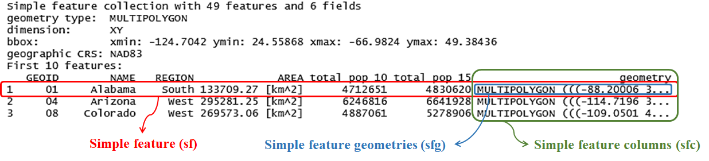
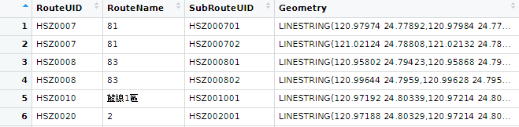
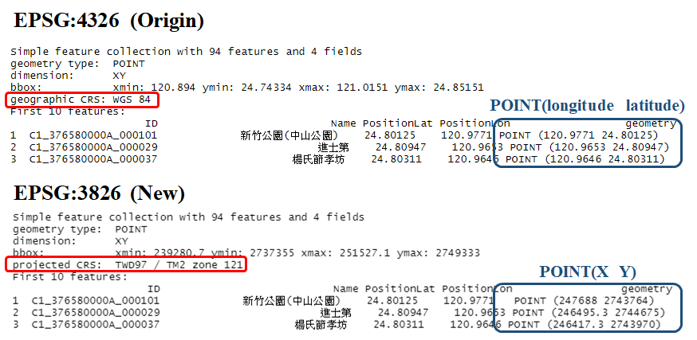
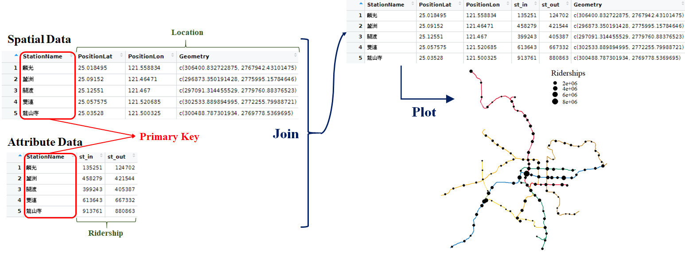

```{r setup3, include=FALSE}
knitr::opts_chunk$set(echo = TRUE)
library(dplyr)
library(sf)
library(ggplot2)
library(ggsflabel)
library(ggspatial)
library(knitr)
library(kableExtra)
library(spData)
library(tmap)
library(leaflet)
library(classInt)
library(cowplot)
library(data.table)
```

# **Geographic Data**

We have introduced the concept of [WKT](#well-known-text-wkt) in the previous section, and then we may come up with a few questions: Can R understand WKT format? And how R produce the WKT format from its base code and sf package? In this section, we would first introduce "sf" class and learn the fundamental skill about how geographic data is built. Then, we would further discuss about the transformation of CRS and the method to export the shapefile. Spatial data combines the geometric information and its attributes, and thus, the study on how to join both of them together would be followed by. Please note that, we would use sf package in this section (also the first time to use), and make sure you have this package downloaded (`install.packages("sf")`).  


## Simple Feature Geometries (sfg)
Usually, we have the geographic data in shapefile format downloaded from the website. This allows us to plot the map or do geometric operations without defining the WKT. However, what if we are asked to define the geometric based on WKT format on our own? Simple feature geometries (sfg) helps us to create these objects.  

The sfg class contains (multi-)point, (multi-)linestring, (multi-)polygon and geometry collection. A set of functions which start with st_ prefix and end with the name of geometry type create the sfg objects. For instance, `st_point()` creates the POINT of WKT format. sfg objects can be created from three base R types:  

```{r sfg_table, echo=F, eval=T}
sfg_table=data.frame(type=c("numeric vector","matrix","list"),
                     code=c("`c( )`","`rbind(c( ), c( ))`","`list(rbind(c( ), c( )))`"),
                     object=c("`st_point`","`st_linestring`\\\n`st_multipoint`","`st_polygon`\\\n`st_multilinestring`\\\n`st_multipolygon`"))
colnames(sfg_table)=c("R Data Type","Code","sfg Object")
kbl(sfg_table, booktabs=T)%>%
  kable_styling(bootstrap_options=c("striped", "hover"), font_size=14)%>%
  column_spec(1, bold=T)
```

Based on the table, we then use the functions of sfg objects to generate geometric information in WKT format.  

### **Point**
```{r st_point, echo=T, eval=T, fig.width=3, fig.height=3, dpi=90, fig.align="center"}
point_ex=st_point(c(2,3))
class(point_ex)  #identify the data type of sfg object

point_ex  #show the WKT format of geometric data
ggplot(point_ex)+
  geom_sf()
```

### **Linestring**
```{r st_linestring, echo=T, eval=T, fig.width=5, fig.height=3, dpi=90, fig.align="center"}
linestring_ex=st_linestring(rbind(c(2,3), c(4,4), c(3,5), c(1,4)))
linestring_ex
ggplot(linestring_ex)+
  geom_sf()
```

Use `rbind` to create the matrix, combining all the vector cells (`c( )`). Note that the connection of line depends on the sequence of the vector cells in the matrix.  

### **Polygon**
```{r st_polygon, echo=T, eval=T, fig.width=5, fig.height=3, dpi=90, fig.align="center"}
polygon_ex=st_polygon(list(rbind(c(2,3), c(4,4), c(3,5), c(1,4), c(2,3))))
polygon_ex
ggplot(polygon_ex)+
  geom_sf()
```

Note that the polygon should be closed, that is, the first vector in the list is the same as the last one.  

### **Multipoint**
```{r st_multipoint, echo=T, eval=T, fig.width=5, fig.height=3, dpi=90, fig.align="center"}
point_ex=st_multipoint(rbind(c(2,3), c(4,4), c(3,5), c(1,4)))
point_ex
ggplot(point_ex)+
  geom_sf()
```

The R data type in `st_multipoint` is the same as `st_linestring`, which both of them are matrices.  

### **Multilinestring**
```{r st_multilinestring, echo=T, eval=T, fig.width=3, fig.height=3, dpi=90, fig.align="center"}
linestring_ex=st_multilinestring(list(rbind(c(2,3), c(4,4), c(3,5)), rbind(c(2,5), c(1,2))))
linestring_ex
ggplot(linestring_ex)+
  geom_sf()
```

### **Multipolygon**
```{r st_multipolygon, echo=T, eval=T, fig.width=3, fig.height=3, dpi=90, fig.align="center"}
polygon_ex=st_multipolygon(list(list(rbind(c(2,3), c(4,4), c(3,5), c(1,4), c(2,3))),
                      list(rbind(c(1,5), c(2,5), c(3,6), c(1,5)))))
polygon_ex
ggplot(polygon_ex)+
  geom_sf()
```

A polygon is created by a list, and thus, multipolygon is generated by a list of lists.  


## Simple Feature Columns (sfc)
The sfc object is a list of sfg objects, which additionally contains information about the coordinate system (CRS), geometry type and the border of the whole geometry set (listing the minimum and maximum of x-axis and y-axis). sfc object represents the geometry column in sf data frames.  

```{r sfc, echo=T, eval=T, fig.width=4, fig.height=3, dpi=90, fig.align="center"}
point_1=st_point(c(2,3))
point_2=st_point(c(4,2))
point_3=st_point(c(1,1))
point_sfc=st_sfc(point_1, point_2, point_3, crs=4326)  #set the CRS to be 4326 (WGS 84)
point_sfc
ggplot(point_sfc)+
  geom_sf()
```

In this example, we can find that the geometry set consists of three points. The border of the geometry set is listed in the bbox (xmin: 1 ymin: 1 xmax: 4 ymax: 3). CRS is set to be EPSG:4326 (i.e.,latitude–longitude system). And please note the axis of the graph. It is labeled as the latitude and longitude format, instead of the integer value labeled in the sfg objects.  

If we want to check the CRS and border of the geometry, we can use the functions as follows.  

```{r st_check, echo=T, eval=T}
# Check CRS
st_crs(point_sfc)

# Check the border
st_bbox(point_sfc)
```


## Simple Feature (sf)
The sf object does not only contain the geometry information, but sets of features with attributes. The basic component of its geometry data is sfg, which is recorded in WKT format. Remember the us_states data in package spData? Let's take a closer look on it. We know that the class of us_states data is not only sf but data frame. A tuple, namely a row, is a simple feature. A simple feature must contain feature attributes and a simple feature geometries (sfg) object, which defines the location of the tuple. The list-column with the simple feature geometries (sfg) for each tuple is then called simple feature columns (sfc).  

```{r sf_usa, echo=F, out.width="100%", fig.align="center"}

```

Again, in the figure above, we can find that the geometry type is "multipolygon". The border of the us_states data is listed in bbox. CRS used in this data is NAD83 (EPSG:4269).  

How do we create the simple feature on our own? It is simple, just create the attribute in a data frame, and then use `st_sf()` function to combine the attributes and the simple feature columns (sfc). There are two parameters should be given in `st_sf()`. One is data frame, which provides attribute of the features. The other one is geometry, which defines the geometry data that should be based on. If we do not define the CRS in function `st_sfc()`, then it is required to set CRS in function `st_sf()`.  

Example below shows the code to make the simple features of NCTU and NTHU.  

```{r sf_set, echo=T, eval=T}
uni_geom=st_sfc(
  st_point(c(120.999645, 24.789071)),  # define the sfg of first school (NCTU)
  st_point(c(120.996665, 24.796442))   # define the sfg of second school (NTHU)
  ,crs=4326)  # set the CRS

uni=data.frame(
  name=c("NCTU","NTHU"),               # name of schools
  type=c("university","university"),   # type of schools
  phone=c("03-5714769","03-5712121"),  # phone of schools
  geometry=uni_geom                    # put the sfc into the data frame
)

class(uni)  # the class of "uni" is remain a data frame

uni=st_sf(uni, geometry=uni$geometry)  # define the sfc as geometry
# uni=st_sf(uni, geometry=uni$geometry, crs=4326) 

class(uni)  # the class of "uni" changes to data frame as well as sf
```

To check whether the class of data we produce is "sf", we can directly plot the map to confirm it. Let's recall the tmap function to plot the interactive map.  

```{r school_tamp_view, echo=T, eval=T, fig.width=4, fig.height=4, fig.align="center"}
tmap_mode("view")
tm_shape(uni)+
  tm_dots(size=0.2)
```

## Convert Text File to Shapefile
In fact, most of the spatial data is stored as shapefile format, which is simple for us to read the files, plot the map and conduct spatial operations in R. However, some spatial data is saved as [CSV](https://www.wikiwand.com/en/Comma-separated_values) or [XML](https://www.wikiwand.com/en/XML) files. These are not standard geographic data format, and hence, we should convert them in advance. Most of the geometric data they record is under WKT format with pure text (e.g., directly record "`POINT (3 2)`"). But the function `st_sfc()` we have learned in the previous section cannot parse the text, whereas it can only identify the vector, matrix, list data type written in R base code. Here, we would introduce a similar function called `st_as_sfc`, which can help us to read the pure text of WKT.  

```{r st_as_sfc_ex, echo=T, eval=T}
st_as_sfc("POINT(3 2)")
```

Also, a function named `st_as_text()` can retrieve the WKT pure text from the R base data type.  

```{r st_as_text_ex, echo=T, eval=T}
point_ex=st_point(c(3,2))
st_as_text(point_ex)
```

Knowing the skills of `st_as_sfc`, let's take two example data downloaded from government open data, to practice this skill. <font color="red">*_Data needed has been downloaded previously. You placed the file in the same directory as the R script file._* Click [**here**](https://drive.google.com/uc?export=download&id=1TSavur6YcaJO5DCCb5Hsb0HICdwZpeXi) to re-download the file if it is lost.</font>  

Let's use the CSV data named "hsinchu_bus_route" in "csv_files" to produce the bus route map of Hsinchu. There are four columns in this data, including "geometry" columns, which records in WKT format. Use function `read.csv()` to import the CSV data first.    

```{r bus_route_read, echo=T, eval=T}
# read CSV files
BusShape=read.csv("./data/csv_files/hsinchu_bus_route.csv")
```

```{r bus_route_graph, echo=F, eval=T, out.width="70%", fig.align="center"}

```

In the CSV data, the spatial feature is listed in the last column named "geometry". It is recorded as string in the WKT format (`LINESTRING()`). Then, apply the function `st_as_sfc()` to convert the column "Geometry" to simple feature columns (sfc). Finally, use function `st_sf()` to give the data frame with sf class and define its CRS (EPSG:4326).  

```{r bus_route_ex, echo=T, eval=T}
# convert the column "geometry" to sfc
BusShape$Geometry=st_as_sfc(BusShape$Geometry)

# give the data frame with sf class
BusShape=st_sf(BusShape, crs=4326)
```

We can use function `class()` and plot the map to confirm whether we successfully convert CSV file to shapefile.  

```{r bus_route_ex_check, echo=T, eval=T, fig.width=6, fig.height=4, fig.align="center"}
class(BusShape)
tm_shape(BusShape)+
  tm_lines()
```

We are given the geometry directly in WKT format in the example above, so it is easy to transform to spatial data. But what if the data (point) provides longitude and latitude separately in two columns? Here goes an example. We would plot the map regarding scenic spots in Hsinchu. Please import the CSV data named "hsinchu_scenicSpot" in "csv_files" first. There are four columns in the data: ID, Name, PositionLat and PositionLon.  

```{r scenic_spot_ex_read, echo=T, eval=T}
# read CSV files
ScenicSpot=read.csv("./data/csv_files/hsinchu_scenicSpot.csv")
head(ScenicSpot)
```

We need to add a new column (here we name it "geometry") to paste longitude (X) and latitude (Y) together, and then create the WKT format as `POINT(X Y)`. Use `st_as_sfc` to convert the column "geometry" to sfc. Last, apply `st_sf()` to give the data frame with sf class and define its CRS.  

```{r scenic_spot_ex, echo=T, eval=T}
# paste the latitude and longitude together, and create WKT text
ScenicSpot=mutate(ScenicSpot, geometry=paste("POINT(", PositionLon, " ", PositionLat, ")"))
head(ScenicSpot)

# convert the column "geometry" to sfc
ScenicSpot$geometry=st_as_sfc(ScenicSpot$geometry)

# give the data frame with sf class
ScenicSpot=st_sf(ScenicSpot, crs=4326)
```

Use function `class()` and plot the map to confirm whether we successfully convert CSV file to shapefile.  

```{r scenic_spot_ex_check, echo=T, eval=T, fig.width=6, fig.height=4, fig.align="center"}
class(ScenicSpot)
tm_shape(ScenicSpot)+
  tm_dots(col="red")
```


## Reproject Geographic Data
After collecting the shapefile data, we may find that their CRS are not consistent, which may cause error in plotting maps as well as in conducting spatial analysis. Hence, it is required to covert them to a same CRS. The inconsistency of CRS often results from the different origin or purpose of the map. In Taiwan, there are two major type of CRS. One is EPSG:4326, which is recorded in latitude and longitude. The other one is EPSG:3826, which is specifically used for the island. However, since shapefiles are managed and released by different sectors (private sector and gonvernment), CRS has not been unified. Function `st_transform()` can solve this problem by resetting CRS.  

We have converted "ScenicSpot" from CSV file to shapefile in EPSG:4326 in the previous section. In the example below, we would further transform CRS to EPSG:3826.  

```{r st_transform, echo=T, eval=T}
# check the original CRS
st_crs(ScenicSpot)$epsg

# transform CRS
ScenicSpot=st_transform(ScenicSpot, crs=3826)

# check the new CRS
st_crs(ScenicSpot)$epsg
```

Let's compare the data frame of the original one and the new one in the figure below. We can find that the geometry column has been converted based on the CRS.  

```{r st_transform_figure, echo=F, out.width="90%", fig.align="center"}

```

## Geographic Data Export
We know how to import the shapefile in the previous practice (by function `read_sf()`). But how to export the shapefile we make in R? By using function `st_write`, we can export sf data. Two essential parameters should be filled in `st_write()`: `obj` means the object we have produced in R; `dsn` means the directory where we want to save shapefile (the directory should include the name of it and file extension `*.shp`). Sometimes we have Chinese characters in our shapefile, we should additionally add the parameter `layer_options="ENCODING=UTF-8"` to ensure that characters would not be garbled.  

Let's again use "ScenicSpot" in the following example. Export the shapefile to the same directory of your R script. You can definitely use absolute path, or simply use relative path to get the same result.  

```{r shapefile_export, echo=T, eval=T}
# relative path
write_sf(ScenicSpot, "./ScenicSpot.shp", layer_options="ENCODING=UTF-8")
```

Successfully export the shapefile now? If yes, please check the directory you export to. You may find five files. The file extension includes `*.shp`, `*.shx`, `*.dbf`, `*.prj`, and `*.cpg`. The first four files have been introduced in the [previous chapter](#shapefile). The last one; however, is in fact not necessary. It is used to specify the code page for identifying the character encoding to be used.  

## Geographic Data Format
Up to now, we learn how to import and export the shapefile. But is it true that R can only cope with the shapefile format? Apparently not! There are in fact several formats we have not discussed in the past section. Here, we would like to introduce some important geographic data formats that are commonly used in spatial analysis.  

Shapefile is the most popular vector data format. However, it has some limitations listed below:  

1. It is a multi-file format, which consists of at least three files.  
2. It only supports 255 columns and the file size is limited to 2 GB.  
3. It is unable to distinguish between a polygon and a multipolygon.  

In spite of the limitations, we are still inclined to use shapefile, and lots of data provided by government use it. Aside from shapefile, Geopackage is a format for exchanging geospatial information. It defines the rules on how to store geospatial information in a tiny SQLite container. Hence, GeoPackage is a lightweight spatial database container, which allows the storage of vector and raster data. KML (Keyhole Markup Language) is an XML notation for expressing geographic annotation and visualization within two-dimensional maps and three-dimensional Earth browsers. It was developed for use with Google Earth. GeoJSON is an open standard format designed for representing simple geographical features, along with their non-spatial attributes. It is based on the [JSON](https://www.wikiwand.com/en/JSON) format. GPX (GPS Exchange Format) is an XML schema designed as a common GPS data format for software applications. It can be used to describe points, tracks, and routes.  

If we want to export the geographic data in those formats, just simply change the file extension in the directory. Take "ScenicSpot" we produce again, and generate the spatial data in GeoPackage format.  

```{r shapefile_export_gpkg, echo=T, eval=T}
# relative path
write_sf(ScenicSpot, "./ScenicSpot.gpkg")

# import the data and check if it is successfully generated
read_sf("./ScenicSpot.gpkg")
```


## Join Attribute and Spatial Data
In reality, most of the attribute features we want to analyze and spatial feature are not in the same file. Usually, the spatial features are stored as shapefile format, while the attribute features are provided in a CSV or spreadsheet file. Take transportation data for instance. If we want to plot the map showing the number of passengers getting on and off at each MRT stations, we need spatial features recording the location of each stations, and attribute features recording the ridership counts. In this example, the geometry data (shapefile) can be downloaded from [GIS-T website](https://gist.motc.gov.tw/gist_web/MapDataService/Retrieval), while the operating data (spreadsheet) can be derived from [Taipei Rapid Transit Corporation](https://english.metro.taipei/cp.aspx?n=C702FF0562802D53). Apparently, the data management agency and the format of two data are not consistent. Hence, combining data from different sources would be a vital and common task before the spatial analysis.  

A primary key is required among the data to be joined. Primary key is a specific choice of a minimal set of attributes (columns) that uniquely specify a tuple (row) in a table. In other words, primary key is a common column that can help us link the spatial features to attribute features. In the MRT example we have mentioned above, the primary key between spatial and attribute data may be "MRT station name" or "MRT station ID". The procedure of join is illustrated in the figure below.  

```{r join_figure, echo=F, out.width="100%", fig.align="center"}

```

Now, let's join the data provided in package spData. "world" is simple feature data that stores the geometry of the shape of each country. "coffee_data" is a data frame which records the production of coffee in every nations each year. We want to join two data together, and perform the map about the world coffee production by country. Use function `left_join()` to accomplish our goal. In `left_join()`, the first data placed would be on the left-hand side of the new data frame; while the latter one would be on the right-hand side. Parameter `by=""` should be given if the column is specifically to be joined, or the function would join the data based on all the columns that have common name by default. In this example, the primary key is the country name. The column name in both data are the same, which is named "name_long". The code and result are shown below.  

```{r join_coffee, echo=T, eval=T, fig.width=10, fig.height=4, dpi=170, fig.align="center"}
# join the spatial and attribute features
world_coffee=left_join(world, coffee_data, by="name_long")

# print the result
world_coffee[,c("name_long","continent","coffee_production_2016","coffee_production_2017")]

# plot the map (use 2017 data)
ggplot(world)+
  geom_sf(fill=NA)+
  geom_sf(data=filter(world_coffee, !is.na(coffee_production_2017)), aes(fill=coffee_production_2017))+
  scale_fill_continuous(low="#F2E6E6", high="#984B4B")+
  theme(panel.background=element_blank())
```

In the section above, we repeatedly show the method of how to connect the spatial features and attribute features. But actually, for some practical reasons, we tend to drop the geometry object from the data. Use the function `st_drop_geometry()` can do so. Take "ScenicSpot" data again. It is now with spatial features, and we can apply this function to eliminate the geometry.  

```{r st_drop_geometry, echo=T, eval=T}
# check the class of ScenicSpot
class(ScenicSpot)

ScenicSpot=st_drop_geometry(ScenicSpot)
head(ScenicSpot)

# check the class of ScenicSpot again
class(ScenicSpot)
```

## <span style="border-bottom: 3px double black">*_PRACTICE_*</span> 
In this chapter, we have learned the concept of the spatial features as well as attribute features, and show some examples about the method to join the data. Now, it's time for you to practice the three skills on your own.  

* Set up simple features.  
* Join the spatial and attribute data.  
* Plot the map. (Review previous chapter)  

<font color="red">*_Data needed has been downloaded previously. You placed the file in the same directory as the R script file._* Click [**here**](https://drive.google.com/uc?export=download&id=1TSavur6YcaJO5DCCb5Hsb0HICdwZpeXi) to re-download the file if it is lost.</font>  

Three data needed in the example is stored in the file "TRA". "TRA_line" records the name of railway line and its geometry (WKT format), whereas "TRA_station" records the name of train station and its longitude and latitude. Ridership data of November, 2020, is stored in "TRA_ridership". We want to plot the map of the route and station of Taiwan Railway Administration (TRA). The data provided is not in shapefile format, but the CSV files. You should convert it to the simple features in advance based on the skills you have learned. Additionally, please join the data of train station and ridership of each station. Last, plot the map, and the size of point of station should be based on the number of ridership, that is, the station with more ridership should be larger point.  

First of all, since the ridership data is given by date for each stations, we need to sum up all the ridership based on the station before joining the data. We would like to use package `dplyr` to tidy it.  

```{r practice_sf_tidy, echo=T, eval=T}
# read the ridership data
ridership=read.csv("./data/TRA/TRA_ridership.csv")

# the ridership is given by date for each stations
head(ridership)

# group by and summarize the data
ridership=group_by(ridership, staCode)%>%
  summarise(riderships=sum(gateInComingCnt+gateOutGoingCnt))

# print the final result
ridership
```

The rest of the work would be done on your own. Here comes with some tips:  

1. Please note that the data "TRA_line" and "TRA_station" contain Chinese character, so make sure to add `fileEncoding="UTF-8"` in `read.csv()`. 
2. Please use EPSG:4326 as CRS, which is in longitude-latitude form.  
3. Please note that the TRA station code in two data are not the same type. One is numeric, and the other is character. It is recommended to transform all the station code to numeric type. (If the type of station code is not unified, the error would be shown in `left_join()`.)
4. As the column name of data should be joined is not the same, you should define the parameter `by=""` in the following forms: `by=c("A"="B")`. "A" means the data you place in the first parameter in `left_join()`, while "B" means the data placed in the second parameter.  

The result is shown below.  

```{r practice_sf_result, echo=F, eval=T, warning=F, fig.width=4, fig.height=5, dpi=90, fig.align="center"}
windowsFonts(A=windowsFont("Times New Roman"))
windowsFonts(B=windowsFont("標楷體"))

TRA_line=read.csv("./data/TRA/TRA_line.csv", fileEncoding="UTF-8")
TRA_line$Geometry=st_as_sfc(TRA_line$Geometry, crs=4326)
TRA_line=st_sf(TRA_line, geometry=TRA_line$Geometry)

TRA_station=fread("./data/TRA/TRA_station.csv")
TRA_station=mutate(TRA_station, geometry=paste("POINT (",PositionLon," ",PositionLat,")"))
TRA_station$geometry=st_as_sfc(TRA_station$geometry)
TRA_station=st_sf(TRA_station, crs=4326)

TRA_station$StationID=as.numeric(TRA_station$StationID)

TRA_station=left_join(TRA_station, ridership, by=c("StationID"="staCode"))

rd_cla=classIntervals(filter(TRA_station, !is.na(riderships))$riderships, n=4, style="jenks")[[2]]

ggplot(TRA_station)+
  geom_sf(aes(size=riderships))+
  scale_size_continuous(range=c(1,6)*1.5,
                        breaks=rd_cla)+
  geom_sf_text_repel(data=filter(TRA_station, StationID %in% c(1000, 3300, 4400, 7000)), aes(label=StationName), color="red", size=5, family="B", nudge_x=-0.6, nudge_y=0.1)+
  geom_sf(data=TRA_line, color="#090980", size=1)+
  theme(axis.text=element_blank(),
        axis.ticks=element_blank(),
        axis.title=element_blank(),
        legend.text=element_text(size=12, family="A"),
        legend.title=element_text(size=15, family="A"),
        legend.key=element_blank(),
        legend.key.size=unit(0.5, 'cm'),
        panel.background=element_blank())
```