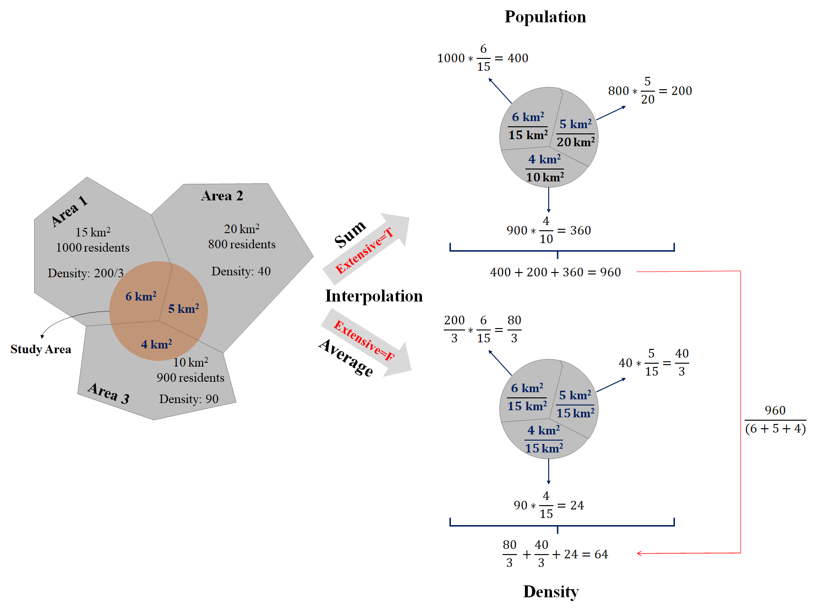
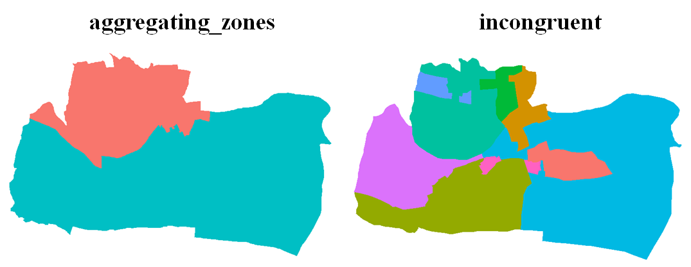
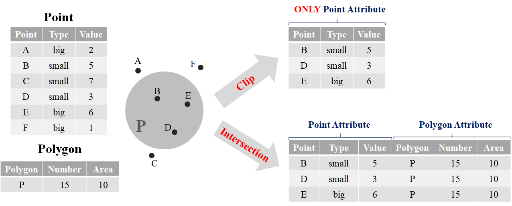
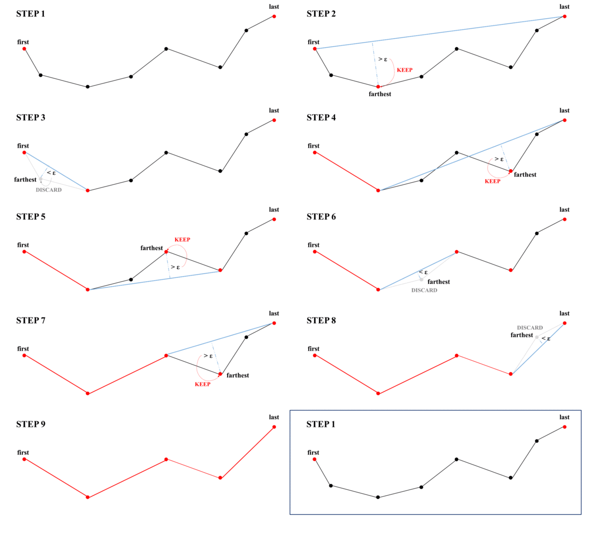
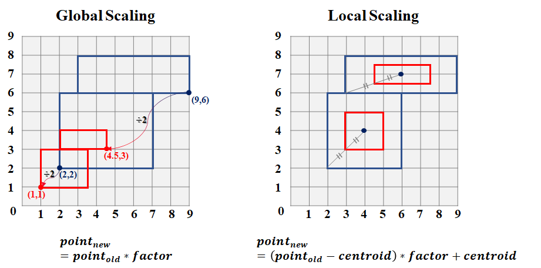
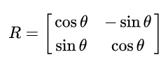
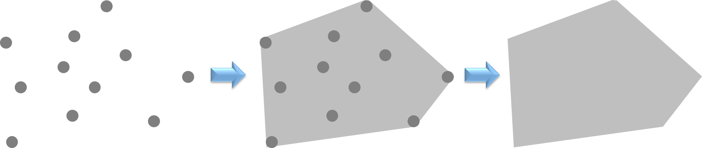

```{r setup, include=FALSE}
knitr::opts_chunk$set(echo = TRUE)
library(dplyr)
library(sf)
library(ggplot2)
library(ggsflabel)
library(ggspatial)
library(knitr)
library(kableExtra)
library(spData)
library(tmap)
library(leaflet)
library(classInt)
library(cowplot)
library(DT)
library(nngeo)
sf::sf_use_s2(FALSE)
```

# **Spatial Operations**

We have learned how geographic datasets are structured in R, and how to join the spatial and attribute features. In this chapter, we would further discuss about the skills of spatial operations. Imagine that we want to know the number of schools in each villages, we should intersect the school point layer and village polygon layer, to identify the polygon for each point located on. "Intersection" is a type of spatial operations. Or imagine we want to know whether there are schools within 500 meters of MRT stations. We need to draw buffer of the stations in advance. "Buffer" is also a type of spatial operations. From the examples above, we find that spatial operations are vital in the spatial analysis.  

We would introduce some common spatial operation functions in package sf. But please note that we would also use some functions in package `dplyr`. If you are not acquainted with the package, please read the notebook attached [here](https://rpubs.com/WeiLunChiang/dplyr), which provides you with a quick learn on the major function in `dplyr` More detailed information of dplyr is supplied in [Chapter 5 of R for Data Science](https://r4ds.had.co.nz/transform.html).  


## Spatial Join
As we have learned in the [previous chapter](#join-attribute-and-spatial-data), joining spatial and attribute data requires a primary key, namely a common column variable. But what if we want to join two spatial data? It applies the similar concept, but relies on the shared areas of geographic space (spatial overlay). We can apply function `st_join(x, y, left)`. The target object which would be in the left part of the new data frame is placed in the first parameter (x), while the joined object is placed in the second parameter (y). Parameter `left=` represents whether do the left join or not, which is `left=T` by default, and return all records of the x object with y fields. If `left=F`, then do the inner join instead.  

Take nz and nz_height in spData for instance. The former data is the map of New Zealand, while the latter is the top 101 highest points in the country. In the example below, we want to know which provinces those points are located in.  

```{r spatial_join, echo=T, eval=T}
st_join(nz_height, nz["Name"])
```

Please note that we should remain the class sf in two parameters. Thus, second parameter in function `st_join()` should not be `nz$name`, which is a numeric type. Use `nz["Name"]` instead, to remain the spatial data.  

You may be confused about the sequence of data placed in function `st_join()`. Let's do a simple comparison. In `st_join(nz_height, nz)`, nz_height is target data, and hence the new data frame is based on all the highest points, and the geometry remains the form of nz_height (point). In `st_join(nz, nz_height)`, nz is the target data, and hence the new data frame is based on the province, and the geometry remains the form of nz (polygon). Try the code yourself might get a better knowing.  

Note that `st_join(..., join=st_intersects)` does the intersection operation by default. If we want to do other operations, we need to revise the parameter `join=` in `st_join(..., join=)`. Function used in `join=` is listed in documentation of  [`geos_binary_pred`](https://www.rdocumentation.org/packages/sf/versions/0.9-7/topics/geos_binary_pred). The features are simply introduced in the table below (not all the functions are appropriate to be applied in `st_join`).  

<span id="geos_binary_pred"></span> 

```{r join_function_table, echo=F, eval=T}
join_function=data.frame(Function=c("**`st_intersects(x,y)`**","**`st_contains(x,y)`**","**`st_disjoint(x,y)`**","**`st_crosses(x,y)`**","**`st_covers(x,y)`**","**`st_covered_by(x,y)`**","**`st_within(x,y)`**","**`st_touches(x,y)`**"), Features=c("identifies if x and y geometry share any space","identifies if x is within y (i.e. point within polygon)","identifies when geometries from x do not share space with y","identifies if any geometry of x have commonalities with y","identifies if any point from x is outside of y (i.e. polygon outside polygon)","identifies if x is completely within y (i.e. polygon completely within polygon)","identifies if x is in a specified distance to y","identifies if geometries of x and y share a common point but their interiors do not intersect"))
kbl(join_function, booktabs=T)%>%
  kable_styling(bootstrap_options=c("striped", "hover"), font_size=14)%>%
  column_spec(1, width="5em")%>%
  column_spec(2, width="29em")
```

## Attribute Aggregation
Aggregation operations summarize datasets (including attributes and spatial features) by a "grouping variable". We can use function `group_by() %>% summarise()` in `dplyr` to conduct aggregation. Let's take data "world" for example. We want to group by the data by continent, and summarize the total population of each continent. The code and result are shown below.  

```{r aggregation_1, echo=T, eval=T, message=F, fig.width=10, fig.height=4, dpi=120}
# map before aggregation
ggplot(world)+
  geom_sf()+
  theme(panel.background=element_blank())

# aggregation operations
continent_pop=group_by(world, continent)%>%
  summarise(pop=sum(pop, na.rm=T))

# glance at new data
continent_pop

# map after aggregation
ggplot(continent_pop)+
  geom_sf()+
  theme(panel.background=element_blank())
```

After aggregation, we can find that the population (attribute) has been summed up based on the continent. The geometry is also aggregated by it, which eliminate the border of each country. The geometry of new map represents the border of each continent.  

Here let's do more practice on the function of `dplyr` Suppose we want to retrieve the data of total population, average life expectancy and the number of countries by subregion. Then, arrange the data by average life expectancy in descending order. The code is shown below.  

```{r aggregation_2, echo=T, eval=T, message=F}
subregion_info=group_by(world, subregion)%>%
  summarise(
    pop=sum(pop, na.rm=T),              # use function sum() to calculate total population
    lifeExp=mean(lifeExp, na.rm=T),     # use function mean() to calculate average life expectancy
    num_cou=n()                         # use function n() to calculate total number in each group
  )%>%
  arrange(desc(lifeExp))                # use arrange to order data, and desc() means descending order

# glance at new data
subregion_info
```

Function `sum()` obtains the total value; `mean()` obtains the average value; `n()` obtains the total number in the group. Parameter `na.rm=T` means that the calculation would skip the NA (not available). If we do not add this parameter, the result would be NA as well. Parameter `desc()` means arrange the data in descending order, or it would be in ascending order by default. As we can see in the result printed above, the first three highest life expectancy are Australia and New Zealand, Western Europe, and Northern America respectively.  

In addition to the application of `dplyr`, we can use function `aggregate()` provided by package `sf` to obtain the same result. The first parameter in the function is the data we want to summarize. Note the data should be remain the sf features. Thus, do not use the form like `world$pop`, whose type is "numeric". Instead, we should write in the form as `world["pop"]`, whose type is "sf" and "dataframe". Parameter `by=` should be filled in with the columns we want to group by. Note that the type of data should be a list. Parameter `FUN` is the spatial operation such as sum or average. Last, if the data contains NA, we should add the parameter `na.rm=T`, in order to skip NA. Again, take data "world" for example, and group by the data by continent, summarize the total population of each continent. The code and result are as follows.  

```{r aggregation_3, echo=T, eval=T}
continent_pop_ag=aggregate(world["pop"], by=list(world$continent), FUN=sum, na.rm=T)
continent_pop_ag
```

You may find that package `dplyr` provides more flexible functions for us in terms of attribute features calculation in spatial analysis. Hence, it is very helpful to use package `sf` and `dplyr` together.  

## Spatial Aggregation
Similar to attribute data aggregation introduced in the previous section, spatial aggregation can be done by function `aggregate()`. In attribute aggregation, the first parameter should be in class sf, while the second parameter `by=` is a list with non-spatial data. There is a little difference on the data imported in parameter `by=`, which the data should also contain geometry in spatial aggregation. Briefly to say, in function `aggregate(x, by=y)`, spatial aggregation is the geometry of the source (y) that defines how values in the target object (x) are grouped.  

Take data nz and nz_height for example. We want to know the average height in each province of New Zealand. The code is shown below.  

```{r aggregation_spatial, echo=T, eval=T}
aggregate(x=nz_height, by=nz, FUN=mean)
```

As the result shows, all of attribute features of data nz_height (first parameter) are average value of each province. And the geometry is based on the spatial data in second parameter `by=`. You may find that the data we obtain are not perfect, since it does not contain the features in second parameter `by=`. Also, it does not make sense to calculate the average of all attribute features. For instance, variable "t50_fid" is the identity number of the highest points, it does not make sense to derive its mean.  

In addition to function `aggregate()`, the same result can also be generated by function `group_by() %>% summarise()` in `dplyr` The code and result are shown below.  

```{r aggregation_spatial_dplyr, echo=T, eval=T, fig.width=10, fig.height=5, dpi=170, fig.align="center"}
ave_height=st_join(nz, nz_height)%>%
  group_by(Name)%>%
  summarise(elevation=mean(elevation, na.rm=T))

# plot the map of average height of each province
ggplot(ave_height)+
  geom_sf(aes(fill=elevation))+
  scale_fill_continuous(low="#CEFFCE", high="#006000")+
  theme(axis.text=element_blank(),
        axis.ticks=element_blank(),
        axis.title=element_blank(),
        panel.background=element_blank())
```

We need to join two spatial data (nz is the target data, which should be placed in the first parameter). Then, group by the variable "Name" and summarize the mean value of elevation in each group. Though the code is longer than function `aggregate()`, `dplyr` shows a readable and clear code to do the spatial aggregation.  

In this example, we can again find that use `dplyr` and `sf` package together might be a better method to do spatial aggregation.  

## Interpolation
Interpolation is the process that calculate estimates from a source set of polygons to an overlapping but incongruent set of target polygons. Imagine that we want to derive the population in a specific area, which is defined by us. Since the boundary of study area we define does not align with the one of population data (most of the population data is based on the villages or Statistical Areas), we should use interpolation to produce estimates in this situation. The concept is simply illustrated in the figure below.  

```{r Interpolation_figure, echo=F, out.width="100%", fig.align="center"}

```

In the figure above, the study area contains three districts whose population have been surveyed. It is covered by 40% of Area 1; 25% of Area 2; and 40% of Area 3. Population is the attribute assumed to be spatially extensive, and the sum is preserved. Hence, we can simply derive the total population of the study area based on the weight of each area: 1000* 40% + 800* 25% + 900* 40% = 960.  

For the study area, there are 40% of it is Area 1; 33.3% of it is Area 2; 26.7% of it is Area 3. Density is spatially intensive instead, and the mean is preserved. Hence, we can simply derive the mean density of the study area based on the area weight of study area: 200/3* 40% + 40* 33.3% + 90* 26.7% = 64.    

Package `sf` provides a function `st_interpolation_aw()` to conduct the interpolation. There are three parameters required in the function `st_interpolate_aw(x, to, extensive)`. The first parameter (x) is the object of simple features, for which we want to aggregate attributes. The second parameter (to) is the object of simple features with the target geometries. Parameter `extensive=` is the operation of data. If it is True, the attribute variables are assumed to be spatially extensive (like population) and the sum is preserved, otherwise, spatially intensive (like population density) and the mean is preserved.  

Here, we use the data incongruent and aggregating_zones provided by package spData. The former one is a specific region separated into 9 districts in UK, while the latter is in the same region, but separated into 2 major area (as the figure shown below). We need to interpolate the value in data incongruent to the geometry data aggregating_zones, and derive the sum of value in two areas. The code and result are shown below.  

```{r interpolation_figure, echo=F, out.width="70%", fig.align="center"}

```

```{r interpolation_aw, echo=T, eval=T}
st_interpolate_aw(incongruent["value"], aggregating_zones, extensive=T)
```

## Unions
Aggregation can dissolve the boundaries of touching polygons in the same group. And what is the behind scene of the function `aggregate()` and `group_by() %>% summarise()`? They combine the geometries and eliminate the boundaries in the group by using function `st_union()`. In the example shown below, we filter the West part of Us states, and then union it by collecting all the geometries together.  

```{r unions, echo=F, echo=T, eval=T}
# filter the west of US states
us_west=filter(us_states, REGION=="West")
head(us_west)

# union us_west
us_west=st_union(us_west)
head(us_west)
```

```{r union_figure, echo=F, eval=T, message=F, fig.width=8, fig.height=3, dpi=170, fig.align="center"}
us_west=filter(us_states, REGION=="West")
us_west_1=ggplot(us_west)+
  geom_sf()+
  theme(axis.text=element_blank(),
        axis.ticks=element_blank(),
        axis.title=element_blank(),
        panel.background=element_blank())

us_west=st_union(us_west)

us_west_2=ggplot(us_west)+
  geom_sf()+
  theme(axis.text=element_blank(),
        axis.ticks=element_blank(),
        axis.title=element_blank(),
        panel.background=element_blank())

windowsFonts(A=windowsFont("Times New Roman"))
plot_grid(us_west_1, us_west_2,
          labels=c("No Union","Union"),
          label_fontfamily="A",
          label_size=12,
          label_y=1,
          ncol=2,
          nrow=1)
```

## Centroid
Centroid operations identify the center of the geographic objects. By using centroid, we can approximately estimate the distance between polygons. Or imagine you want to transform the complex polygon to the point geometry, centroid of the polygon may be a good choice. The most common type of centroid is called geographic centroid, which represents the center of mass in a spatial object. Function `st_centroid()` can generate the centroid. Use data us_states for example to derive the centroids of each states.  

```{r cemtroid_us_states, echo=T, eval=T, fig.width=10, fig.height=5, dpi=120, fig.align="center"}
# derive the centroid
us_states_centroid=st_centroid(us_states)

# plot the map
ggplot(us_states)+
  geom_sf()+
  geom_sf(data=us_states_centroid, color="red")+
  theme(axis.text=element_blank(),
        axis.ticks=element_blank(),
        axis.title=element_blank(),
        panel.background=element_blank())
```

But there is a drawback of `st_centroid()`. If the polygon contains many separated areas, the centroid might not lie on the polygon. For instance, the centroid of the group islands may not be situated in the land of the island, but in the ocean. Function `st_point_on_surface` can solve this problem. It ensures that all of the points will fall in their parent object. But please note that the point `st_point_on_surface` generates does not guarantee to be located in the most largest area. Here comes an example about the centroid and point of surface on Penghu Island, which is located in 50 kilometers west of Taiwan Island. <font color="red">*_Data needed has been downloaded previously. You placed the file in the same directory as the R script file._* Click [**here**](https://drive.google.com/uc?export=download&id=1TSavur6YcaJO5DCCb5Hsb0HICdwZpeXi) to re-download the file if it is lost.</font>  

```{r point_on_surface, echo=T, eval=T, fig.width=3, fig.height=5, dpi=120, fig.align="center"}
# read the shapefile of Taiwan and filter Penghu Island
taiwan_county=read_sf("./data/taiwan_county/taiwan_county.shp")
penghu=filter(taiwan_county, COUNTYCODE==10016)

# derive the centroid
penghu_centroid=st_centroid(penghu)

# derive the point on surface
penghu_point=st_point_on_surface(penghu)

# plot the map
ggplot(penghu)+
  geom_sf()+
  geom_sf(data=penghu_point, color="red", size=2)+
  geom_sf(data=penghu_centroid, color="blue", size=2)+
  theme(axis.text=element_blank(),
        axis.ticks=element_blank(),
        axis.title=element_blank(),
        panel.background=element_blank())
```

In Penghu example, we can find that the point on surface (red dot) and the centroid (blue dot) are not the same. Centroid is located in the inland sea of Penghu, while the point on surface is located in one of the island of Penghu. Please note that the island which point on surface located in is not the largest one. For more information of its algorithm, please refer to the [discussion](https://gis.stackexchange.com/questions/76498/how-is-st-pointonsurface-calculated) attached.  

## Buffer
Imagine that we want to calculate the number of schools within 500 meters radius of MRT stations, we need to first draw the buffer of each MRT stations before points calculation. Buffer is a zone (polygon) around a map feature within given distance, and it is useful for proximity analysis. Buffer can be created by function `st_buffer()`, whatever the type of geometry is. There are two parameters should be filled in `st_buffer()`. Place the spatial data first, and then set the distance of radius. But please note that the unit of distance is based on the coordinate reference system. In general, the unit is meter (m) in the [projected coordinate system](#coordinate-reference-system-crs), while the unit is NULL in the the geographic coordinate systems (e.g., EPSG:4326). Hence, we need to use function [`st_transform()`](#reproject-geographic-data) to convert CRS to specific projected coordinate system in the region of study area, if the spatial data with CRS EPSG:4326 is obtained.  

Examples below illustrates the buffer of cycle hire points across London. Data cycle hire is provided by package spData. Suppose we define the region within 300 meters of hire points is service area.  

```{r buffer_warning, echo=T, eval=T}
# test of the CRS and buffer of cycle_hire
st_crs(cycle_hire)$epsg             # original CRS: EPSG:4326 (geographic)
st_crs(cycle_hire)$units            # units: NULL
st_buffer(cycle_hire, 300)
```

The warning shows that `st_buffer()` does not correctly buffer longitude-latitude spatial data, whose distance is assumed to be in decimal degrees (arc_degrees). Though the operation of geometry is still done, it is not true. (You can plot the map to check what the geometry looks like.) Hence, we should not use the spatial data with EPSG:4326 to create buffer, but transform CRS in advance. However, what CRS should be applied? We can look up the CRS of England in [EPSG database](https://epsg.io/?q=England).  

```{r buffer, echo=T, eval=T, fig.align="center"}
# transform CRS to EPSG:27700 (projected)
cycle_hire_new=st_transform(cycle_hire, crs=27700)

# create the buffer (radius: 300 m)
st_buffer(cycle_hire_new, 300)
```

```{r buffer_figure, echo=F, eval=T, fig.width=6, fig.height=3, dpi=110, fig.align="center"}
cycle_hire_new=st_transform(cycle_hire, crs=27700)
cycle_hire_buf=st_buffer(cycle_hire_new, 300)
cycle_hire_buf_uni=st_union(cycle_hire_buf)
ggplot(cycle_hire_buf_uni)+
  geom_sf(fill="#75AADB", color="#ADADAD")+
  geom_sf(data=cycle_hire_new, size=1)+
  theme(axis.text=element_blank(),
        axis.ticks=element_blank(),
        axis.title=element_blank(),
        panel.background=element_blank())
```

Figure above shows the location of cycle hire points (black dots), and the buffer of each point is painted blue.  

## Boundary
Function `st_boundary()` creates a polygon that encompasses the full extent of the geometry. Boundary and union are often applied together to emphasize the border of the study area. The example below shows the us_state and makes the border of country thicker.  

```{r boundary, echo=T, eval=T, fig.width=6, fig.height=3, dpi=90, fig.align="center"}
# union us_states and then derive the boundary
us_boundary=st_boundary(st_union(us_states))

# plot the map
ggplot(us_states)+
  geom_sf()+
  geom_sf(data=us_boundary, size=1)+
  theme(axis.text=element_blank(),
        axis.ticks=element_blank(),
        axis.title=element_blank(),
        panel.background=element_blank())
```

## Clipping
Clipping is a critical spatial operation in GIS. It extracts the geometry (point, line, polygon) that lies within the area outlined by the clip polygon. For instance, we have polygon of Taipei City and points of schools in Taiwan, and suppose we want to extract the schools located in Taipei City. We need to use the polygon to clip the point data, removing all the points outside the polygon. Though there is no "clip" function provided by package `sf` in fact, function `st_intersection()` help us do so. But please note that there is a difference between clipping and intersection in an accurate GIS definition. Clipping and intersection both extracts the geometry in a specific polygon; nonetheless, clipping does not retain the attributes of the clip polygon, while intersection creates output features which possess the attributes of all input features. The concept is illustrated below.  

```{r clip_intersection_figure, echo=F, out.width="90%", fig.align="center"}

```

The slight difference may be a fundamental concept of GIS, but it is not really vital in terms of spatial analysis in R (after all, there is no clip function provided in R). In `st_intersection(x, y)`, it is free to place the spatial data in two parameters. But please note data x would be on the left-hand side of new data frame, while y is on the right-hand side. Here we use the example of nz (map of New Zealand) and nz_height (101 highest point in New Zealand) again. Suppose we want to extract the points located in North Island, the code and result are shown below.  

```{r intersection, echo=T, eval=T}
# filter North Island in data nz
nz_north=filter(nz, Island=="North")

# st_intersection(point, polygon)
st_intersection(nz_height, nz_north)

```

Remember the spatial join operation? Actually, we can use function [`st_join()`](#spatial-join) to do the same thing. The code is shown below.  

```{r intersection_union, echo=T, eval=T}
# union two data first
nz_height_join=st_join(nz_height, nz)

# filter the highest point located in North Island
filter(nz_height_join, Island=="North")
```

In this example, we find that function `st_join()` and `st_intersection()` do the similar operation. This is because that `st_join()` sets the operation to "intersection" by default, that is, the parameter is `st_join(..., join="st_intersects")`. Other operations are listed in the table of [`geos_binary_pred`](#geos_binary_pred).  

In addition to `st_intersection`, there are some functions to do subsetting and clipping spatial data. To illustrate the concept and operations of these functions, we use a simple example: two overlapping circles (X and Y), with a center point one unit away from each other and a radius of one. The code and results are shown below.  

```{r clip_operation, echo=T, eval=F}
X=st_buffer(st_point(c(1,1)), dist=1)
Y=st_buffer(st_point(c(2,1)), dist=1)

st_intersection(X, Y)
st_difference(X, Y)
st_difference(Y, X)
st_union(X, Y)
st_sym_difference(X, Y)
```

```{r clip_operation_figure, echo=F, eval=T, fig.width=10, fig.height=6, dpi=90, fig.align="center"}
windowsFonts(A=windowsFont("Times New Roman"))

X=st_buffer(st_point(c(1,1)), dist=1)
Y=st_buffer(st_point(c(2,1)), dist=1)

intersection_XY=st_intersection(X, Y)
difference_XY=st_difference(X, Y)
difference_YX=st_difference(Y, X)
union_XY=st_union(X, Y)
sym_differnece=st_sym_difference(X, Y)

fg1=ggplot()+
  geom_sf(data=X, fill=NA)+
  geom_sf(data=Y, fill=NA)+
  geom_sf_text(data=X, aes(label="X"), nudge_x=-0.4, size=6)+
  geom_sf_text(data=Y, aes(label="Y"), nudge_x=0.4, size=6)+
  theme_minimal()+
  theme(axis.title=element_blank())

fg2=ggplot()+
  geom_sf(data=X, fill=NA)+
  geom_sf(data=Y, fill=NA)+
  geom_sf(data=intersection_XY, fill="#75AADB")+
  geom_sf_text(data=X, aes(label="X"), nudge_x=-0.4, size=6)+
  geom_sf_text(data=Y, aes(label="Y"), nudge_x=0.4, size=6)+
  theme_minimal()+
  theme(axis.title=element_blank())

fg3=ggplot()+
  geom_sf(data=X, fill=NA)+
  geom_sf(data=Y, fill=NA)+
  geom_sf(data=difference_XY, fill="#75AADB")+
  geom_sf_text(data=X, aes(label="X"), nudge_x=-0.4, size=6)+
  geom_sf_text(data=Y, aes(label="Y"), nudge_x=0.4, size=6)+
  theme_minimal()+
  theme(axis.title=element_blank())

fg4=ggplot()+
  geom_sf(data=X, fill=NA)+
  geom_sf(data=Y, fill=NA)+
  geom_sf(data=difference_YX, fill="#75AADB")+
  geom_sf_text(data=X, aes(label="X"), nudge_x=-0.4, size=6)+
  geom_sf_text(data=Y, aes(label="Y"), nudge_x=0.4, size=6)+
  theme_minimal()+
  theme(axis.title=element_blank())

fg5=ggplot()+
  geom_sf(data=X, fill=NA)+
  geom_sf(data=Y, fill=NA)+
  geom_sf(data=union_XY, fill="#75AADB")+
  geom_sf_text(data=X, aes(label="X"), nudge_x=-0.4, size=6)+
  geom_sf_text(data=Y, aes(label="Y"), nudge_x=0.4, size=6)+
  theme_minimal()+
  theme(axis.title=element_blank())

fg6=ggplot()+
  geom_sf(data=X, fill=NA)+
  geom_sf(data=Y, fill=NA)+
  geom_sf(data=sym_differnece, fill="#75AADB")+
  geom_sf_text(data=X, aes(label="X"), nudge_x=-0.4, size=6)+
  geom_sf_text(data=Y, aes(label="Y"), nudge_x=0.4, size=6)+
  theme_minimal()+
  theme(axis.title=element_blank())

plot_grid(fg1, fg2, fg3, fg4, fg5, fg6,
          labels=c("","st_intersection(X, Y)","st_difference(X, Y)","st_difference(Y, X)","st_union(X, Y)","st_sym_difference(X, Y)"),
          label_fontfamily="A",
          label_size=12,
          label_x=0.1,
          hjust=0,
          ncol=3,
          nrow=2)
```

## Simplification
When plotting the map, it is better to remove the detailed data and trivial information which may make the map complicated. This process is called cartographic generalization. It seeks to abstract spatial information at a high level of detail to information that can be rendered on a map at a lower level of detail. One of the main type of generalization is simplification. It simplifies the geometry, and result in reducing the amount of memory. To do simplification, many algorithms have been developed, such as [Ramer–Douglas–Peucker algorithm](https://www.wikiwand.com/en/Ramer%E2%80%93Douglas%E2%80%93Peucker_algorithm) and [Visvalingam–Whyatt algorithm](https://www.wikiwand.com/en/Visvalingam%E2%80%93Whyatt_algorithm). Let's take a closer look on Ramer–Douglas–Peucker algorithm illustrated in the figure below.  



The algorithm initially finds the point that is farthest from the line segment with the first and last points as end points. If the distance between the point and line segment is shorter than the minimum threshold ε, then any other points can be discarded. If the distance is greater than ε, the point must be kept. The algorithm recursively calls itself with the first point and the farthest point and then with the farthest point and the last point, which includes the farthest point being marked as kept.  

Function `st_simplify()` provided in package `sf` can do so. The simplification operation can be applied on all of the geometries (point, line, polygon). In function `st_simplify(x, dTolerance)`, spatial data is placed in the first parameter (x). Parameter `dTolerance` represents the minimum threshold (ε). Please note that the spatial data should be in projected coordinate system, or it might cause error. We can use function `st_crs()$unit` to confirm whether the unit is "meter". If it is NULL, it represents the data is in geographic coordinate system, please look up the appropriate CRS in [EPSG database](https://epsg.io/). Here, let's simplify the map of US states as code shown below.  

```{r simplification, echo=T, eval=T}
# check the unit (if NULL, convert CRS)
st_crs(us_states)$units

# transform CRS to 2163
us_states_2163=st_transform(us_states, crs=2163)

# simplification (ε = 100000 meters = 100 kilometers)
st_simplify(us_states_2163, dTolerance=100000)
```

```{r simplification_result, echo=F, eval=T, fig.width=8, fig.height=3, dpi=170, fig.align="center"}
us_states_2163=st_transform(us_states, crs=2163)
us_states_2163=st_simplify(us_states_2163, dTolerance=100000)

us_states_ori=ggplot(us_states)+
  geom_sf()+
  theme(axis.text=element_blank(),
        axis.ticks=element_blank(),
        axis.title=element_blank(),
        panel.background=element_blank())

us_states_new=ggplot(us_states_2163)+
  geom_sf()+
  theme(axis.text=element_blank(),
        axis.ticks=element_blank(),
        axis.title=element_blank(),
        panel.background=element_blank())

windowsFonts(A=windowsFont("Times New Roman"))
plot_grid(us_states_ori, us_states_new,
          labels=c("Original","Simplification"),
          label_fontfamily="A",
          label_size=12,
          label_y=0.95,
          ncol=2,
          nrow=1)
```

## Affine Transformations
Affine transformation is a geometric transformation that preserves lines and parallelism, but might change length or angle. It includes shifting, scaling and rotation. Affine transformation is usually used to improve map visualization, or to revise the distorted projected map. Contents below illustrates the codes and results of three basic transformations by using spatial data `us_states`.  

Before conducting affine transformation, please ensure that the data should be based on projected coordinate system, namely the unit is "meter". In previous section, we knew that `us_states` is in geographic coordinate system, and hence, we should transform CRS to the projected one (EPSG:2163).  

```{r us_states_crs, echo=T, eval=F}
# transform CRS to 2163
us_states_2163=st_transform(us_states, crs=2163)
```

In addition, the transformation is implemented on the [sfg](#simple-feature-geometries-sfg) and [sfc](#simple-feature-columns-sfc) object, instead of [sf](#simple-feature-sf) (the whole spatial data). Thus, please conduct the transformation on the geometry column in spatial data, such as the form `DATA$geometry`. `DATA` means the spatial data (sf), and use `$` to retrieve the `geometry` (sfc) in the data.  

Shifting moves every point by the same distance in map units. It can be simply achieved by adding vector object after the spatial data. For instance, in the example below, we shift all x-coordinate by 500,000 meters to the east, while shift all y-coordinate 300,000 meters to the south.  

```{r us_states_shift_code, echo=T, eval=F}
# shift the map
us_states_shift=us_states_2163$geometry+c(500000,-300000)
```

```{r us_states_shift_map, echo=F, eval=T, fig.width=5, fig.height=3, dpi=90, fig.align="center"}
us_states_2163=st_transform(us_states, crs=2163)
us_states_shift=us_states_2163$geometry+c(500000,-300000)
us_states_shift=st_sf(us_states_shift, crs=2163)
ggplot()+
  geom_sf(data=us_states_2163, color=NA)+
  geom_sf(data=us_states_shift, fill="#75AADB", color=NA, alpha=0.6)+
  theme(axis.text=element_blank(),
        axis.ticks=element_blank(),
        axis.title=element_blank(),
        panel.background=element_blank())
```

Scaling enlarges or shrinks objects by a factor. There are two types of scaling, global and local. Global scaling increases or decreases all coordinate values in relation to the origin coordinates (0,0), while keeping all geometries topological relations intact. It can be done by multiplying a factor on sfg or sfc object. Local scaling is based on each fixed specific point (e.g, centroid), and multiply the scaling factor by the distance of the geometries to the specific point. The concept of global and local scaling are illustrated as figure below.  

```{r scale_figure, echo=F, out.width="70%", fig.align="center"}

```

The following code and result show the **global scaling** (shrink) of us_states.  

```{r us_states_scale_code_1, echo=T, eval=F}
us_states_scale=us_states_2163$geometry/2
```

```{r us_states_scale_map_1, echo=F, eval=T, warning=F, fig.width=5, fig.height=3, dpi=90, fig.align="center"}
us_states_2163=st_transform(us_states, crs=2163)
us_states_scale=us_states_2163$geometry/2
us_states_scale=st_sf(us_states_scale, crs=2163)
ggplot()+
  geom_sf(data=us_states_2163, color=NA)+
  geom_sf(data=us_states_scale, fill="#75AADB", color=NA, alpha=0.6)+
  theme(axis.text=element_blank(),
        axis.ticks=element_blank(),
        axis.title=element_blank(),
        panel.background=element_blank())
```

The following code and result show the **local scaling** (shrink) of us_states.  

```{r us_states_scale_code_2, echo=T, eval=F}
# find the centroid first
us_states_centroid=st_centroid(us_states_2163)

# new point = (vector of geometry to centroid) * factor + centroid
us_states_scale=(us_states_2163$geometry-us_states_centroid$geometry)/1.3+us_states_centroid$geometry
```

```{r us_states_scale_map_2, echo=F, eval=T, warning=F, fig.width=5, fig.height=3, dpi=90, fig.align="center"}
us_states_2163=st_transform(us_states, crs=2163)
us_states_centroid=st_centroid(us_states_2163)
us_states_scale=(us_states_2163$geometry-us_states_centroid$geometry)/1.3+us_states_centroid$geometry
us_states_scale=st_sf(us_states_scale, crs=2163)
ggplot()+
  geom_sf(data=us_states_2163, color=NA)+
  geom_sf(data=us_states_scale, fill="#75AADB", color=NA, alpha=0.6)+
  theme(axis.text=element_blank(),
        axis.ticks=element_blank(),
        axis.title=element_blank(),
        panel.background=element_blank())
```

Rotation in two-dimensional coordinate can be done by the rotation matrix shown below. It rotates geometry in a counterclockwise direction.  

```{r rotation_matrix_figure, echo=F, out.width="20%", fig.align="center"}

```

The rotation function is listed as follows.  

```{r rotation_function, echo=T, eval=T}
rotation=function(x){
  # covert degree to radian
  r=x*pi/180
  # rotation matrix
  matrix(c(cos(r), sin(r), -sin(r), cos(r)), nrow=2, ncol=2)
}
```

Rotation could be done around a specific point. The vector generated by the geometries and specific point should multiply by the rotation matrix, and then add the coordinate of specific point to derive the coordinate of geometries after rotation. Detailed information of rotation matrix, please review [linear algebra](https://www.wikiwand.com/en/Rotation_matrix). The rotation of us_states is as follows.  

```{r us_states_rotation_code, echo=T, eval=F}
# find the centroid first
us_states_centroid=st_centroid(us_states_2163)

# new point = (vector of geometry to centroid) * rotation matrix + centroid
us_states_rotation=(us_states_2163$geometry-us_states_centroid$geometry)*rotation(30)+us_states_centroid$geometry
```

```{r us_states_rotation_map, echo=F, eval=T, warning=F, fig.width=5, fig.height=3, dpi=90, fig.align="center"}
us_states_2163=st_transform(us_states, crs=2163)
us_states_centroid=st_centroid(us_states_2163)
us_states_rotation=(us_states_2163$geometry-us_states_centroid$geometry)*rotation(20)+us_states_centroid$geometry
us_states_rotation=st_sf(us_states_rotation, crs=2163)
ggplot()+
  geom_sf(data=us_states_2163, color=NA)+
  geom_sf(data=us_states_rotation, fill="#75AADB", color=NA, alpha=0.6)+
  theme(axis.text=element_blank(),
        axis.ticks=element_blank(),
        axis.title=element_blank(),
        panel.background=element_blank())
```

## Geometric Measurement
Geometric measurement is mainly to measure the area, length and distance of the geometries. The operation can be done by the function `st_area`, `st_length` and `st_distance` in package `sf` respectively. Geometric measurement is very useful when it comes to calculating the population density (area), the radial distance between two points (distance) and lots of practical issues. But please note that the precision of the geometric measurement depends on the projection of the map (CRS). If we use the geographic coordinate systems (latitude–longitude, e.g., EPSG:4326) to measure the geometries, we may obtain a wrong result. This is because the geographic coordinate systems uses a three-dimensional spherical surface to define a location on the earth with longitudes and latitudes in degrees, and of course, the measurement on two-dimensional must result in the high deviation. The measurement of functions can be well-performed when the geometries in a correct projected coordinate system, which defines the X and Y of two-dimensional geometry. Here, we do not further discuss about the theory on the measurement difference among CRS, which requires better technical knowledge on the GIS, but just realize how to do calculation by using package `sf`.  

`st_area` is used to calculate the area of the polygon. Take data `lnd` in package `spData` for instance. `lnd` is the data that records all of the boroughs in London with the attributes such as name, official code, area, and so forth.

```{r measure_area, echo=T, eval=T, warning=F}
st_area(lnd)
```

Simply place the data in the function `st_area()`, we would get the result. It shows the area of each borough in the sequence of the original data `lnd`, for example, the first row is Kingston upon Thames, and its area is 37275804 [m^2]. But is the result correct? We can then check the answer in the attribute fields of data `lnd`, which records the area in column named HECTARES. What's surprising? The result are not identical. Column HECTARES in `lnd` tells us the area of Kingston upon Thames is 3726.117 [hectares], which is equal to 37261170 [m^2]; however, the result we get from `st_area` is 37275804 [m^2]. What's our mistake?  

The inconsistent results are derived from the wrong CRS we use. First of all, we can check the CRS of data `lnd`. Using function `st_crs()` to identify the coordinate system, we can find that the CRS is EPSG:4326 (geographic coordinate systems). As mentioned above, the geographic coordinate systems is defined in spherical surface, which is not appropriate to directly conduct geometric measurement. Hence, we need to convert it to coordinated system by function [`st_transform`](#reproject-geographic-data) in advance, ensuring the precision of result. Please look up the CRS of London (England) in [EPSG database](https://epsg.io/?q=England).

```{r measure_area_revise, echo=T, eval=T, warning=F}
# check out the CRS of lnd
st_crs(lnd)$epsg

# The project coordinate system of England is 27700 
lnd_27700=st_transform(lnd, crs=27700)
st_area(lnd_27700)

lnd_27700$HECTARES
```

Fortunately, we can derive a more precise area of each polygon. Please note that they are still not equal, possibly because of the problem of CRS issue again, but the difference between what we calculate and the attributes recorded (HECTARES) shrinks.  

Length means to measure the length of a line, which can be operated by function `st_length()`. Take the perimeter of a country border for instance.  

```{r measure_length, echo=T, eval=T, warning=F}
lnd_27700_border=st_boundary(lnd_27700)
st_length(lnd_27700_border)

```

The result shows the length of border of each boroughs in London. The unit is meters.  

Last, `st_distance()` helps us to calculate the distance between pairs of geometric features. In transportation field, we often expect to calculate the distance of any two points, to roughly identify the radial distance of an OD pair, and construct the OD matrix. The elements of `st_distance()` is a bit complicated than the previous. Function `st_distance(x, y, by_element)` returns a dense numeric matrix of dimension length(x) by length(y) when parameter `by_element=F` (default). That is, if x consists of 5 points, and y consists of 4 points, then there are 5*4=20 results of distance, which is a complete matrix. If parameter `by_element=T` is set, then the distance is calculated by row, and the shorter one being recycled. And if there is only one data in the function, then it means to construct the complete distance matrix of the data. Here, we take the first five rows of data `nz_height` (data records the top 101 highest points in New Zealand) provided by `spData` for example.  

```{r measure_distance, echo=T, eval=T, warning=F}
nz_height_5=nz_height[1:5,]
st_distance(nz_height_5)
```

With only one data in the function, the result shows the complete distance matrix of the 5 points. And now, a bit more complicated, let's calculate the distance between the first 5 points to the centroid of its regions (polygons). In this case, we need to find out the region of each points located by using function [`st_intersection()`](#clipping), and create a new variable called "nz_height_region". However, doing intersection can only get the attribute of data `nz`, the geometry type remains "POINT". Hence, we need to join the geometry data by using `left_join()` and use [`st_sf()`](#simple-feature-sf) to re-make the simple feature data. The next step is to retrieve the centroid of each region, and create a new variable named "nz_height_region_centroid". Last, we can calculate the distance of the points and the centroids of its region located in. And remember to add the parameter `by_element=T`, to ensure the distance is calculated by row, instead of a complete matrix. To sum up, the operation is tortuous, but review some of the basic operations mentioned in this chapter up to now.  

```{r measure_distance_by, echo=T, eval=T, warning=F}
# intersection to find out regions of each points located
nz_height_region=st_intersection(nz_height_5, nz)

# left join to retrieve the geometries of polygon
nz_height_region=left_join(st_drop_geometry(nz_height_region), nz)

# the simple feature is converted to data frame, hence use st_sf() to retrieve the sf
nz_height_region=st_sf(nz_height_region)

# calculate the centroid of each region
nz_height_region_centroid=st_centroid(nz_height_region)

# calculate the distance of highest points and its region
st_distance(nz_height_5, nz_height_region_centroid, by_element=T)
```

The geometric measurement is vital and basic in terms of doing spatial analysis. In this section, we can learn how to calculate the area, length and distance. The only issue we do not address is that the precision of calculation, if interested, please find other resources to get deeper understanding.  

## Nearest Analysis
In practical issue, we often want to know the nearest point of the feature, for instance, the nearest MRT station of the school. One method is to construct the complete distance matrix, and filter the nearest one by using function [`st_distance()`](#geometric-measurement). But obviously, it sounds very time-consuming. Package `sf` provided a function called `st_nearest_feature()` to get the index of the nearest geometry. Let's take Youbike and MRT Station in Taipei for example, and supposed we want to know the nearest MRT station of each YouBike station. <font color="red">*_Data needed has been downloaded previously. You placed the file in the same directory as the R script file._* Click [**here**](https://drive.google.com/uc?export=download&id=1TSavur6YcaJO5DCCb5Hsb0HICdwZpeXi) to re-download the file if it is lost.</font>  

In function `st_nearest_feature(X, Y)`, the result shows that for each geometry in X, the index of the nearest geometry in set Y. And note that the feature (geometry) can be point, line and polygon. In our case, we want to know the nearest MRT station of YouBike station, and hence, we should place YouBike data in the first parameter (X), while the MRT data should be placed in the second parameter. The code and result are shown below. Before conducting the analysis, be aware at the "transfer station" of MRT! For transfer stations, though the station names are identical, they represent different geometry due to they are belong to different MRT lines. As a result, we can revise them by removing the data with duplicated station name. The work can be done by function `distinct()` from package `dplyr`.  

```{r nearest_feature, echo=T, eval=T, warning=F}
# import the shapefile
taipei_mrt_station=read_sf("./data/taipei_mrt/taipei_mrt_station.shp")
taipei_youbike=read_sf("./data/taipei_youbike/taipei_youbike.shp")

# remove the duplicated station names of transfer stations
taipei_mrt_station=select(taipei_mrt_station, Zh_tw)%>%
  distinct()

# find the nearest feature
near_mrt=st_nearest_feature(taipei_youbike, taipei_mrt_station)

# st_nearest_feature gives the index of the MRT data
head(near_mrt)

# combine the data
near_mrt_result=data.frame(YouBike=taipei_youbike$StatnNm,
                           MRT=taipei_mrt_station[near_mrt,]$Zh_tw)
# near_mrt_result
```

```{r nearest_feature_table, echo=F, eval=T, warning=F}
datatable(near_mrt_result, options=list(pageLength=10))
```

Again, we must note that the result of function `st_nearest_feature()` retrieves is the "index" of nearest feature, not the simple feature itself. For instance, the first row of YouBike data is station "YouBike1.0_捷運市政府站(3號出口)", and the index of its nearest feature is 104, that is, the 104<sup>th</sup> row of MRT data (市政府).  

Now, we know how to derive the index of the nearest feature, but what if we want to obtain the line between the nearest points? It can be done by the function named `st_nearest_points()`. The function gets nearest points between pairs of geometries, and output the linestring between two points. It does not only process on the point feature, but also the line and polygon. Let's do a simple test on this function regarding the nearest point on the polygon. Here we randomly choose 2 MRT stations, 台北車站 and 忠孝復興, to draw their buffers (polygon), and choose other 5 MRT stations (龍山寺, 民權西路, 台電大樓, 六張犁, 松山機場) to be the test points. By using the function, we can obtain the nearest points on each buffer for all the test points. The code and result are shown below.  

```{r nearest_point, echo=T, eval=T, warning=F}
# choose 2 MRT stations
mrt1=filter(taipei_mrt_station, Zh_tw %in% c("台北車站", "忠孝復興"))

# choose other 5 MRT stations
mrt2=filter(taipei_mrt_station, Zh_tw %in% c("龍山寺","民權西路","台電大樓","六張犁","松山機場"))

# draw buffers
mrt1=st_buffer(mrt1, 500)

# get the nearest point on each feature
mrt1_2=st_nearest_points(mrt1, mrt2)
```

The class of result is "sfc_LINESTRING" and "sfc", namely, they have no attribute data, but merely record the geometric feature. Let's plot the map to observe the result. We can find that the function retrieves the lines that connect all the test points to the nearest point on the buffer.  

```{r nearest_point_map, echo=F, eval=T, warning=F, message=F, fig.width=2, fig.height=2, dpi=170, fig.align="center"}
tmap_mode("view")
tm_shape(mrt1_2)+
  tm_lines()+
  tm_shape(mrt1)+
  tm_polygons(alpha=0.2, col="#75AADB")+
  tm_text("Zh_tw")+
  tm_shape(mrt2)+
  tm_dots()+
  tm_text("Zh_tw", ymod=2)
```

In addition, continuing on the work we have done on the nearest MRT station of each YouBike station, we can use function `st_nearest_points()` to obtain the connection line on the map. But please note that we should add parameter `pairwise=T` to ensure the function returns nearest points between subsequent pairs, instead of all pairs.  

```{r nearest_feature_line, echo=T, eval=T, warning=F}
# pairwise: return nearest points between subsequent pairs
nearest_line=st_nearest_points(taipei_youbike, taipei_mrt_station[near_mrt,], pairwise = TRUE)
```

```{r nearest_feature_line_map, echo=F, eval=T, warning=F, message=F, fig.width=4, fig.height=4, dpi=170, fig.align="center"}
tmap_mode("view")
tm_shape(nearest_line)+
  tm_lines()+
  tm_shape(taipei_mrt_station)+
  tm_dots(col="#01B468", size=0.03)+
  tm_shape(taipei_youbike)+
  tm_dots(col="#FF9224", size=0.01)
```

We have learned the method to capture the nearest point of the feature. But sometimes, we do not only need the nearest one, but the second, third,... nearest points. Unfortunately, package `sf` does not support to do so. Again, the most intuitive way is to calculate the distance and then sort them by the value, but it is somehow complicated. Function `st_nn()` in package `nngeo` solve this problem. It can obtain several (k) nearest points by setting parameter `k=` in the function. Let's first set `k=1` to observe the result of the nearest point, checking whether the result are identical to the one from function `st_nearest_feature()`. Using the case of Taipei MRT and YouBike stations for example again.  

```{r nngeo, echo=T, eval=F, warning=F}
# install the package `nngeo` first
install.packages("nngeo")
library(nngeo)
```

```{r st_nn_k1, echo=T, eval=T, warning=F}
# find the nearest feature (set k=1)
near_mrt_k1=st_nn(taipei_youbike, taipei_mrt_station, k=1)

# take a glance on the result
head(near_mrt_k1)
```

The result is recorded in the list. If you want to retrieve the numeric type of the data, please use the following code: `unlist(near_mrt_k1)`. The first element in the list is 104, which means that the 104<sup>th</sup> row of MRT data is the nearest MRT station for the first row of YouBike data. Furthermore, we can find that the results derived from two different packages are the same.  

Then, the following code tests for the first three nearest MRT stations of each YouBike station.  

```{r st_nn_k3, echo=T, eval=T, warning=F}
# find the first three nearest feature (set k=3)
near_mrt_k3=st_nn(taipei_youbike, taipei_mrt_station, k=3)

# transform the list to the matrix
near_mrt_k3=matrix(unlist(near_mrt_k3), ncol=3,  byrow=T)

# take a glance on the result
head(near_mrt_k3)
```

The first three nearest points are shown in the matrix above. It tells us that the first three nearest MRT station index of the first YouBike station (YouBike1.0_捷運市政府站(3號出口)) are 116 (市政府), 117 (永春), 25 (象山) respectively. The following table lists all the result according to the real station name.  

```{r st_nn_k3_table, echo=F, eval=T, warning=F}
near_mrt_k3=data.frame(near_mrt_k3)
near_mrt_k3=data.frame(MRT_nn1=taipei_mrt_station[near_mrt_k3$X1,]$Zh_tw,
                       MRT_nn2=taipei_mrt_station[near_mrt_k3$X2,]$Zh_tw,
                       MRT_nn3=taipei_mrt_station[near_mrt_k3$X3,]$Zh_tw)
near_mrt_k3=cbind(YouBike=taipei_youbike$StatnNm, near_mrt_k3)
datatable(near_mrt_k3, options=list(pageLength=10))
```

Last, it's important to mention that function `st_nn()` can also derive the distance of k nearest point, simply by adding the parameter `returnDist=T`. The function would also output the distance result in the list.  

## Convex Hull
The convex hull of a shape is the smallest convex set that contains in the geometry, illustrated as the figure below. There are many algorithms developed to seek for the convex hull in the decades, mainly to decrease the complexity of the algorithm and increase the efficiency. We do not further discuss about the detailed and technical approach to find the convex hull, but simply use the function provided by package `sf` to obtain the result.  

```{r convex_hull_figure, echo=F, out.width="90%", fig.align="center"}

```

If we want to find the convex hull of several points, remember to union all the points together by function [`st_union()`](#unions), and then use `st_convex_hull()` to get the convex hull of all the points. Here we use Taipei YouBike station again to retrieve its convex hull.  

```{r convex_hull, echo=T, eval=T, warning=F}
# union all the points
youbike_union=st_union(taipei_youbike)

# do the convex hull
youbike_convex=st_convex_hull(youbike_union)
```

```{r convex_hull_map, echo=F, eval=T, warning=F}
town=read_sf("./data/taipei_map/taipei_village_map.shp")
town=group_by(town, TOWNNAME)%>%
  summarise()
ggplot()+
  geom_sf(data=town, color="#F0F0F0", fill="#BEBEBE")+
  geom_sf(data=youbike_convex, alpha=0.5, color=NA, fill="#75AADB")+
  geom_sf(data=taipei_youbike, color="#FF9224", size=0.01)+
  theme(panel.background=element_blank(),
        axis.title=element_blank(),
        axis.text=element_blank(),
        axis.ticks=element_blank())
```

Convex hull can also roughly identify the service area of the public facilities (e.g., fire stations ,police offices), public transport stations and so forth. Here, we again take Taipei YouBike station for example, and simply define the nearest MRT station to be the major service point, from the first mile and last mile point of view. Thus, the convex hull of YouBike stations for each MRT station can be interpreted as the service area of MRT stations regarding first and last mile service. Now, let's do the convex analysis on all the YouBike stations of each nearest MRT station. The code and result are shown below.  

```{r convex_hull_youbike, echo=T, eval=T, warning=F}
# near_mrt_result is dervied from section 5.13 Nearest Analysis
near_mrt_sf=left_join(near_mrt_result, taipei_youbike[, c("StatnNm","PostnLn","PostnLt")], by=c("YouBike"="StatnNm"))

# convert the data frame to simple feature
near_mrt_sf=st_sf(near_mrt_sf)

# group by each MRT station and draw the convex hull
near_mrt_convex=group_by(near_mrt_sf, MRT)%>%
  summarise()%>% 
  st_convex_hull()
```

```{r convex_hull_youbike_map, echo=F, eval=T, warning=F, fig.width=8, fig.height=4, dpi=200}
tmap_mode("view")
tm_shape(st_transform(near_mrt_convex, crs=4326))+
  tm_fill(col="#75AADB", alpha=0.6)+
  tm_shape(taipei_youbike)+
  tm_dots(col="#FF9224", size=0.01)+
  tm_shape(taipei_mrt_station)+
  tm_dots(col="#01B468", size=0.03)
```

From the map above, we can realize the YouBike service area of each MRT station. But we can find that some of the YouBike station are not in any convex hull. What happened? In fact, those MRT station contain only two or less YouBike stations, and thus, can not derive the polygon as results.  

## Voronoi Polygon
Voronoi diagram is a partition of a plane into regions close to each of a given set of objects.


