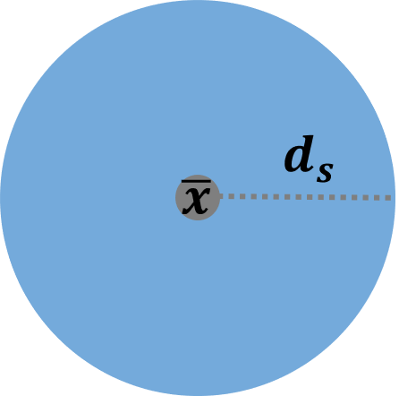
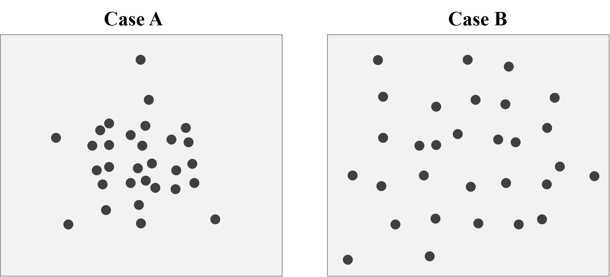
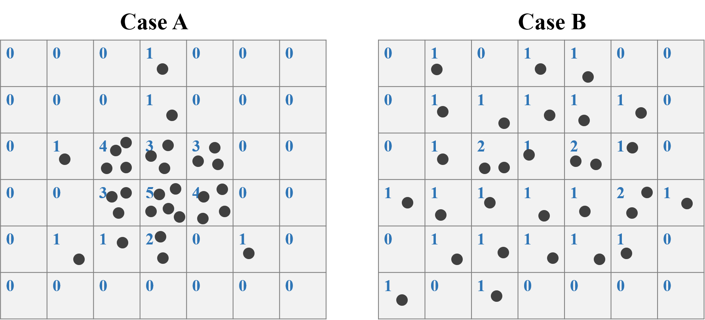
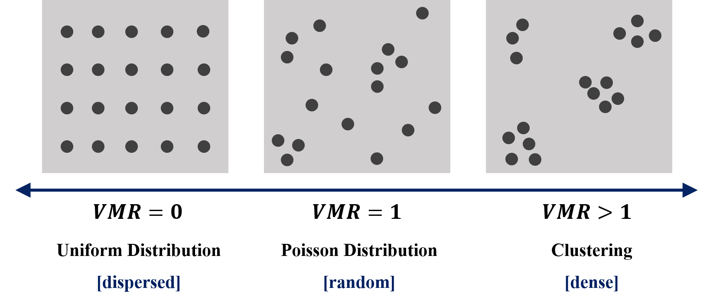

```{r setup5, include=FALSE}
knitr::opts_chunk$set(echo = TRUE)
library(dplyr)
library(sf)
library(ggplot2)
library(ggsflabel)
library(ggspatial)
library(ggrepel)
library(knitr)
library(kableExtra)
library(spData)
library(tmap)
library(leaflet)
library(classInt)
library(cowplot)
library(DT)
library(nngeo)
library(RColorBrewer)
library(aspace)
sf_use_s2(FALSE)
```

# **Basic Quantitative Geography **

From chapter 3 to 5, we have learned how to make maps and do spatial operations, they are all fundamental and vital contents regarding spatial analysis. The operations we have learned could help us identify what the space "looks like"; however, up to now, we have no idea about "what space tells". Hence, this chapter would introduce the basic theory and application of quantitative geography. We would learn the point patterns and spatial auto correlation, which are relatively simple in this field, and can also apply to the analysis on transportation issue. Note that there are much more to explore other than these two elements, if interested, please refer to the textbook [Spatial Data Analysis - An Introduction For GIS Users](https://vdoc.pub/documents/spatial-data-analysis-an-introduction-for-gis-users-7kgftthl78g0).  

In this chapter, we require a preliminary knowledge on statistics, especially the concept of hypothetical test.  

## Point Patterns Analysis

### **Basic measures**
Two commonly used summary measures of point pattern analysis are the mean center and the standard distance. The mean center of a point pattern implies the central tendency of the whole points. It is simply the mean of the x and y coordinates:  

$$\bar{\bf{x}}=(\frac{\sum_{i=1}^n \ {x_i}}{n}, \quad \frac{\sum_{i=1}^n \ {y_i}}{n})$$
In the equation above, the bold letter $\bar{\bf{x}}$ represents a vector of X and Y coordinates, and the number of points is $n$. Besides mean, the other basic statistic is "standard deviation", that is, the standard distance in the spatial analysis. This standard distance can be interpreted as the dispersion around the mean center:  

$${d_s}=\sqrt{\frac{\sum_{i=1}^n \ {{(x_i-\mu_x)}^2+{(y_i-\mu_y)}^2}}{n}}$$

```{r center_analysis_figure, echo=F, out.width="20%", fig.align="center", dpi=200}

```

As for the center analysis, we may come up with the function [`st_centroid`](#centroid). However, the function can only use on the center of polygon, it can not retrieve the center of multiple points. An easiest way is to do the summary of X and Y coordinates of the whole points. Take Taipei YouBike for instance. <font color="red">*_Data needed has been downloaded previously. You placed the file in the same directory as the R script file._* Click [**here**](https://github.com/ChiaJung-Yeh/Spatial-Analysis/raw/master/data.zip) to re-download the file if it is lost.</font> First, we need to convert X and Y coordinates by using `st_coordinates()`, and then, just calculate the mean and standard deviation on the data converted.  

```{r center_summary, echo=T, eval=T, warning=F}
# import the shapefile
taipei_youbike=read_sf("./data/taipei_youbike/taipei_youbike.shp")

# retrieve the coordinated of the points
taipei_youbike_coor=st_coordinates(taipei_youbike)

# calculate mean and standard deviation
apply(taipei_youbike_coor, 2, FUN=mean)
apply(taipei_youbike_coor, 2, FUN=var)^0.5
```

From the results above, we can know that the mean of X is 304679.5, while the mean of Y is 2771747.9. Also the standard deviation of X and Y are 3143.041 and 3905.884 respectively. Thus, the standard distance would be $\sqrt{(3143.041^2+3905.884^2)}=5013.45$ meters. Figure below shows the center and standard distance of Taipei YouBike.  

```{r center_map, echo=F, eval=T, warning=F, fig.width=5, fig.height=3, dpi=150, fig.align="center"}
town=read_sf("./data/taipei_map/taipei_village_map.shp")
town=group_by(town, TOWNNAME)%>%
  summarise()
u_center=st_sf(mutate(data.frame(t(apply(taipei_youbike_coor, 2, FUN=mean))),
                      geometry=st_as_sfc(paste0("POINT(", X, " ", Y, ")"))), crs=3826)
u_distance=st_buffer(u_center, 5013.45)
ggplot()+
  geom_sf(data=town, color="#F0F0F0", fill="#BEBEBE")+
  geom_sf(data=u_distance, fill="#75AADB", color=NA, alpha=0.6)+
  geom_sf(data=u_center)+
  theme(panel.background=element_blank(),
        axis.title=element_blank(),
        axis.text=element_blank(),
        axis.ticks=element_blank())
```

There is another package called `aspace` that can calculate the center and standard distance directly. But very unfortunately, this package has been removed from CRAN recently. Thus, please download the zip file [**here**](https://github.com/ChiaJung-Yeh/Spatial-Analysis/raw/master/data.zip), and place it into the same directory as your R script file. The installation code from the local is as follows.  

```{r aspace_install, echo=T, eval=F, warning=F}
install.packages("devtools")
devtools::install_local("./aspace-master.zip")
library(aspace)
```

Now, let's again use YouBike data to retrieve its center and standard distance by function `mean_centre()` and `calc_sdd` provided by package `aspace`.  

```{r center_youbike, echo=T, eval=T, warning=F}
youbike_center=mean_centre(points=taipei_youbike_coor)
youbike_sdd=calc_sdd(points=taipei_youbike_coor)
```

We can find that the result from two methods are approximately the same. Note that `$SDD.radius` represents the standard distance, and it causes only 3 meters difference from what we calculate above. In addition, there is a function called `CF()` that can identify the central feature within a set of point locations. That is, the center of the points must be one of the points.  

```{r center_youbike_CF, echo=T, eval=T, warning=F}
youbike_center_CF=CF(points=data.frame(taipei_youbike_coor))

# use left_join() to find out what the station is
left_join(youbike_center_CF, cbind(taipei_youbike, st_coordinates(taipei_youbike)), by=c("CF.x"="X", "CF.y"="Y"))%>%
  select(StatnNm, CF.x, CF.y)
```

```{r center_youbike_map, echo=F, eval=T, warning=F, fig.width=5, fig.height=3, dpi=150, fig.align="center"}
youbike_center_CF=left_join(youbike_center_CF, cbind(taipei_youbike, st_coordinates(taipei_youbike)), by=c("CF.x"="X", "CF.y"="Y"))%>%
  select(StatnNm, CF.x, CF.y)

windowsFonts(A=windowsFont("Times New Roman"))
ggplot()+
  geom_sf(data=town, color="#F0F0F0", fill="#BEBEBE")+
  geom_sf(data=st_sf(mutate(youbike_center, geometry=st_as_sfc(paste0("POINT(", CENTRE.x, " ", CENTRE.y, ")"))), crs=3826), color="#2894FF")+
  geom_sf(data=st_sf(mutate(youbike_center_CF, geometry=st_as_sfc(paste0("POINT(", CF.x, " ", CF.y, ")"))), crs=3826), color="#FF5151")+
  geom_text(data=cbind(type="MEAN", youbike_center), aes(x=CENTRE.x, y=CENTRE.y, label=type), family="A", nudge_y=1000)+
  geom_text(data=cbind(type="CF", youbike_center_CF), aes(x=CF.x, y=CF.y, label=type), family="A", nudge_y=-1000)+
  theme(panel.background=element_blank(),
        axis.title=element_blank(),
        axis.text=element_blank(),
        axis.ticks=element_blank())
``` 

Besides the general calculation of center and standard distance, package `aspace` can also consider the weights. The general center can only represent the geographical position, but cannot reflect the one affected by the social and economic factors. Now let's move on to the shapefile of Taipei village in the downloaded data, which contains the attribute of population for each village. And our purpose is to find out the "geographical centroid" and the "center of the population density" of each district in Taipei City. Obtaining these two values, we can compare the difference of two kind of points, and explain the implications.  

For the centroid of town, simply use function [`st_centroid()`](#centroid) to retrieve the center of each district. As for the calculation of weighted center, it is suggested to use `for` loop. First of all, we need to calculate the population density of each village, which equals to population divided by the area. Then, finding the centroid of each village by function `st_centroid()` to be the representative point of the village. Next, use function `mean_centre()` and set the parameters `weighted=T` and `weights=...`, to calculate the center of all the points revised by the weight of population density. And, also, apply function `calc_sdd()` to calculate the standard distance under the influence of weight. The code and result are shown below.  

```{r center_village, echo=T, eval=T, warning=F, message=F, results=F}
# import shapefile
village=read_sf("./data/taipei_map/taipei_village_map.shp")

weight_analysis=data.frame()
for (i in unique(village$TOWNNAME)){
  # filter the town
  village_dis=filter(village, TOWNNAME==i)
  
  # find the centroid of town
  town_center=st_centroid(filter(town, TOWNNAME==i))
  town_center=st_coordinates(town_center)

  # find the centroid of each village (representative points)
  village_center=st_centroid(village_dis)
  
  # retrieve the coordinate of each point
  village_center_coor=st_coordinates(village_center)
  
  # set the weights as population density
  # population density = population / area
  # st_area retrieves "unit" type data, and the unit is m^2, thus use as.numeric to convert it, and divide by 1,000,000
  village_center_pd=mean_centre(points=village_center_coor, weighted=T, weights=(village_dis$PP/(as.numeric(st_area(village_dis))/1000000)))
  
  vil_sdd_pd=calc_sdd(points=village_center_coor, weighted=T, weights=(village_dis$PP/(as.numeric(st_area(village_dis))/1000000)))
  
  # store the result in the table
  weight_analysis=rbind(weight_analysis, data.frame(TOWN=i, town_center, village_center_pd[2:3], vil_sdd_pd$SDD.radius))
}

head(weight_analysis)
``` 


```{r center_village_map, echo=F, eval=T, warning=F, fig.width=5, fig.height=3, dpi=150, fig.align="center"}
head(weight_analysis)
town=group_by(village, TOWNNAME)%>%
  summarise()
town_centroid=select(weight_analysis, X, Y)%>%
  mutate(geometry=st_as_sfc(paste0("POINT(", X, " ", Y, ")")))%>%
  st_sf(crs=3826)
village_center_pd=select(weight_analysis, CENTRE.x, CENTRE.y, vil_sdd_pd.SDD.radius)%>%
  mutate(geometry=st_as_sfc(paste0("POINT(", CENTRE.x, " ", CENTRE.y, ")")))%>%
  st_sf(crs=3826)
vil_sdd_pd=st_buffer(village_center_pd, village_center_pd$vil_sdd_pd.SDD.radius)

windowsFonts(B=windowsFont("標楷體"))
ggplot()+
  geom_sf(data=village, color="#F0F0F0", fill="#BEBEBE", size=0.01)+
  geom_sf(data=town, fill=NA, color="#4F4F4F")+
  geom_sf(data=town_centroid, color="#2894FF")+
  geom_sf(data=village_center_pd, color="#FF5151")+
  geom_sf(data=vil_sdd_pd, fill="#FF9797", color=NA, alpha=0.5)+
  geom_text_repel(data=data.frame(town, st_coordinates(st_centroid(town))) %>% filter(TOWNNAME %in% c("北投區","士林區","文山區", "南港區","大同區")),
                  aes(x=X, y=Y, label=TOWNNAME), family="B", size=2, nudge_y=-0.4, nudge_x=0)+
  theme(panel.background=element_blank(),
        axis.title=element_blank(),
        axis.text=element_blank(),
        axis.ticks=element_blank())

``` 

In the figure shown above, the blue dots represent the geographical centroid, which is the center of the polygons, while the red dots represent the centers weighted by the population density of each village in. Also, the red buffer means the weighted standard distance of each district. Take a closer look on the map. We can find that the district adjacent to the mountanious area, for instance 北投區, 士林區, 文山區, 南港區 have a larger difference between the geographical centroid and the population weighted center. Obviously, it is because people tend to live in plains with abundant living requirements. For the districts near CBD, such as 大同區, the differences between two points are slight.  

This can further prove that using "geographical centroid" may not be meaningful, for it does not correspond to the real life. The weighted center can illustrate the population distribution, and even signify the land use of each district in Taipei City. To sum up, learning how to derive the weighted center may be an importaant issue in spatial analysis.  

### **Quadrat Analysis**
In the previous section, we have learned how to derive the centroid and the standard distance. For these two values, we can roughly realize the central tendency of the points distribution; however, we have no clear clue to tell whether the points distribution is dipersed, dense or random. Now, we would further discuss the density of the points by using a statistical method called **Quadrat Analysis**.  

Quadrat analysis is a common method of exploring spatial pattern in the number of events. Specifically, in this analysis, we should first divide the study area into several grids. Then, count the number of points fall within each grid square. After counting the points, we should find a statistical measure to assess the distribution of point counts in grids, and determine whether the distribution is dipersed (uniform distribution), dense (cluster), or random (Poisson distribution). The steps are explained in detail with an simple example.  

Figure below shows two cases of the point distribution. The number of points are the same (30) for two cases, but apparently the points pattern are totally different. We can easily observe that the distribution of Case A is dense, and the cluster is obvious, while the distribution of Case B is dipersed, and is approximately uniform distributed.  

```{r quard_1_figure, echo=F, out.width="90%", fig.align="center", dpi=200}

```

<span style="text-decoration:underline">**STEP 1: Make Grids**</span>  
To do the Quadrat analysis, the initial step is to crop the study area into several grids, and count the number of points in each grid. Take Case A and B for instance. We crop the study area into 7*6=42 grids. For case A, the maximum number of points is 5, while only 2 for Case B.  

```{r quard_2_figure, echo=F, out.width="90%", fig.align="center", dpi=200}

```

<span style="text-decoration:underline">**STEP 2: Derive Mean & Variance**</span>  
After counting the points in each grid in STEP 1, we need to further calculate the mean and variance of number of counts for all the grids. For Case A, the counts of mean is:  

$$\frac{{(0+0+0+1+0+0+0)+(0+0+0+1+0+0+0)+(0+1+4+3+3+0+0)}+...}{6*7}=0.714$$


, and the variance is:  

$$\frac{{(0-0.714)^2+(0-0.714)^2+(0-0.714)^2+(1-0.714)^2}+...}{6*7-1}=1.770$$  
Also, the mean and variance of Case B is 0.714 and 0.355 respectively.  

<span style="text-decoration:underline">**STEP 3: Caluculate VMR**</span>  

Variance/mean ratio (VMR) is an index of dispersion, which is a common measure of assessing the degree of clustering or regularity in a point pattern.  

$$VMR=\frac{\sigma^2}{\mu}$$

What does it mean if the variance is equal to mean ($VMR=1$)? Remember the Poisson distribution? It is a discrete distribution that measures the probability of a given number of events happening in a specified time period (or the grid in spatial analysis). Mean and variance must be the same for this distribution!! Proof is attached [here](https://proofwiki.org/wiki/Variance_of_Poisson_Distribution). With this feature, we can say that the number of points are random underlying the Poisson distribution.  

The minimum value of VMR is 0, it occurs only if the variance is equal to 0. That is, all of the number of points in each grid is the same, and we can identify this point pattern as perfectly uniform distribution (extremely dipersed). On the contrary, if VMR is larger than 1, it implies that there is too much variation among counts, and we can say that the point pattern is clustering. Figure below summarizes the concept of VMR.  

```{r quard_type, echo=F, out.width="80%", fig.align="center", dpi=200}

```

Thus, VMR of Case A is $1.770/0.714=2.479$, while VMR of case B is $0.355/0.714=0.497$. Based on the summary in the figure above, we can find that Case A is clustering, and Case B is dipersed.  

<span style="text-decoration:underline">**STEP 4: Test Statistic**</span>  
However, here comes a question. How do we distinguish between 1.001 and 1, or 0.999 and 1? Do the two values represent random or not? To solve the problem, we should conduct the hypothetical test to examine whether the test statistic result is significant. The null hypothesis is that the points are randomly distributed ($VMR=1$), namely, Poisson distribution, and it is chi-squared with $N-1$ degrees of freedom. The test statistic of VMR is:  

$$\chi^2=(N-1)*VMR$$
, where $N$ is the number of grid cells. After calculating $\chi^2$, we can check for the chi-square table to examine whether to reject the null hypothesis. And note that VMR statistic test is a two-tail chi-squared test because there are two directions of deviations apart from the random distribution, that is uniform distribution, whose $\chi^2$ would be low, and the clustering, whose $\chi^2$ would be high. Thus, the acceptance of null hypothesis of an adequate fit if:  

$$\chi^2_.975\leq\chi^2_{Observed}\leq\chi^2_.025$$

For Case A, the Chi-square is $(42-1)*2.479=101.639$. The degree of freedom is $42-1=41$. Look up chi-square table, the critical value is 45.72 under p value is 0.025. (Or, please use `qchisq(0.025, 41, lower.tail=F)` in R to find out). Apparently, $74.37>60.56$, Case A is significant clustering. For Case B, the Chi-square is $(42-1)*0.497=20.38$. The degree of freedom is also $42-1=41$. Look up chi-square table, the critical value is 25.21 under p value is 0.975. (`qchisq(0.975, 41, lower.tail=F)`). And because $20.38<25.21$, Case B is significant dispersed.  

Now, let's use YouBike data to perform quadrat analysis. <font color="red">*_Data needed has been downloaded previously. You placed the file in the same directory as the R script file._* Click [**here**](https://github.com/ChiaJung-Yeh/Spatial-Analysis/raw/master/data.zip) to re-download the file if it is lost.</font>  


### **Nearest Neighbour Analysis**


## Spatial Autocorrelation Analysis


